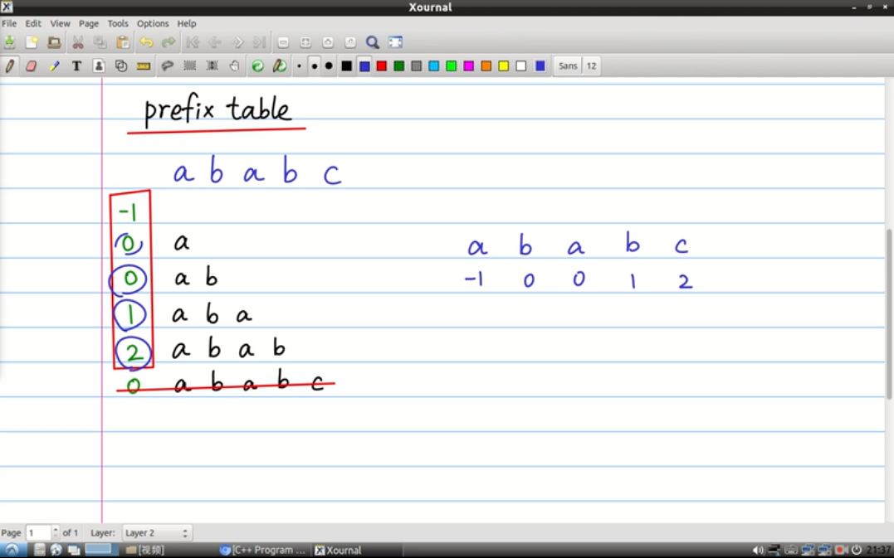
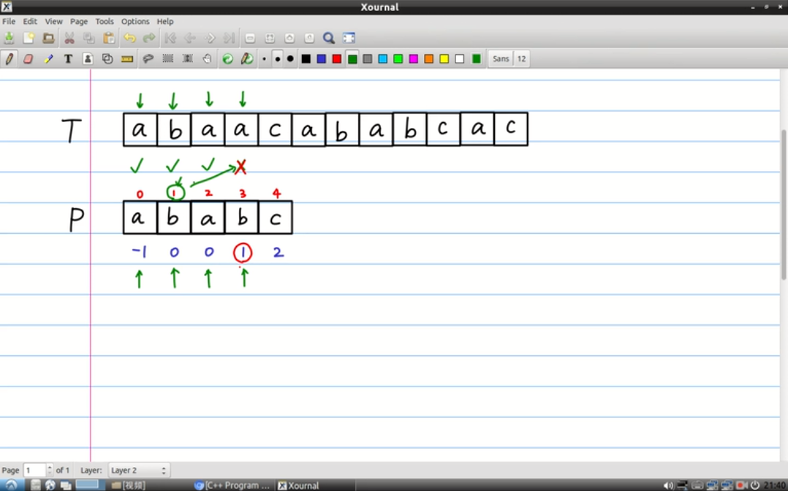
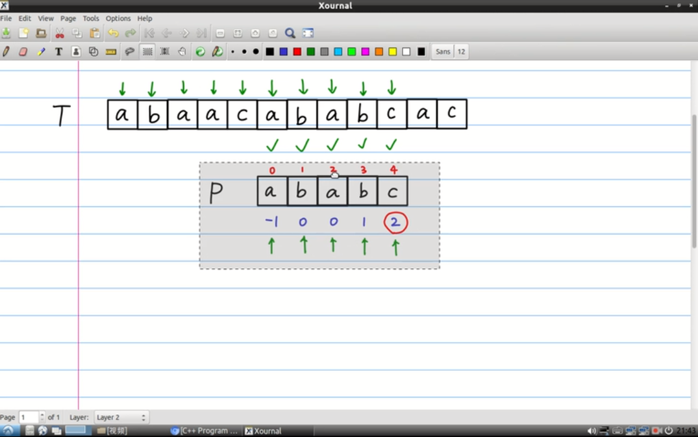

# algorithms

<!-- vim-markdown-toc Marked -->

- [algorithms](#algorithms)
  - [1.排序算法](#1排序算法)
    - [1.1冒泡排序(bubble sort)](#11冒泡排序bubble-sort)
    - [1.2选择排序(selection sort)](#12选择排序selection-sort)
    - [1.3插入排序(insertion sort)](#13插入排序insertion-sort)
    - [1.4归并排序(merge sort)](#14归并排序merge-sort)
    - [1.5快速排序(quick sort)](#15快速排序quick-sort)
    - [1.6堆排序(heap sort)](#16堆排序heap-sort)
    - [1.7桶排序(bucket sort)](#17桶排序bucket-sort)
    - [1.8计数排序(counting sort)](#18计数排序counting-sort)
    - [1.9基数排序(radix sort)](#19基数排序radix-sort)
  - [2.查找算法](#2查找算法)
    - [2.1顺序查找](#21顺序查找)
    - [2.2二分查找](#22二分查找)
    - [2.3差值查找](#23差值查找)
    - [2.4动态查找](#24动态查找)
    - [2.5哈希查找](#25哈希查找)
    - [2.6斐波那契查找](#26斐波那契查找)
    - [2.3分块查找(索引查找)](#23分块查找索引查找)
  - [a.算法思想](#a算法思想)
    - [a.1迭代法](#a1迭代法)
    - [a.2穷举搜索法](#a2穷举搜索法)
    - [a.3递推法](#a3递推法)
    - [a.4动态规划](#a4动态规划)
    - [a.5贪心算法](#a5贪心算法)
    - [a.6回溯法](#a6回溯法)
    - [a.7分治算法](#a7分治算法)
  - [b.其他算法](#b其他算法)
    - [b.1快慢指针](#b1快慢指针)
    - [b.2前缀和](#b2前缀和)
    - [b.4二叉树相关算法](#b4二叉树相关算法)
      - [b.4.1DFS(前中后序遍历)](#b41dfs前中后序遍历)
      - [b.4.2BFS层序遍历](#b42bfs层序遍历)
    - [b.5朴素贝叶斯算法](#b5朴素贝叶斯算法)
    - [b.6推荐算法](#b6推荐算法)
    - [b.7图的算法](#b7图的算法)
      - [b.7.1最小生成树算法](#b71最小生成树算法)
      - [b.7.2拓扑排序](#b72拓扑排序)
      - [b.7.3关键路径](#b73关键路径)
      - [b.7.4最短路径](#b74最短路径)
  - [x.经典基础算法](#x经典基础算法)
    - [x.1Hash](#x1hash)
    - [x.2快速排序](#x2快速排序)
    - [x.3快速选择](#x3快速选择)
    - [x.4BFS/DFS(广度/深度优先算法)](#x4bfsdfs广度深度优先算法)
    - [x.5红黑树](#x5红黑树)
    - [x.6KMP算法](#x6kmp算法)
    - [x.7动态规划](#x7动态规划)
    - [x.8A*寻路算法](#x8a寻路算法)
    - [x.9Dijkstra最短路径算法](#x9dijkstra最短路径算法)
    - [x.10遗传算法](#x10遗传算法)
    - [x.11启发式搜索算法](#x11启发式搜索算法)
    - [x.12图像特征提取之SIFT算法](#x12图像特征提取之sift算法)
    - [x.13傅里叶变换](#x13傅里叶变换)
    - [x.14SPGA单元最短路径算法](#x14spga单元最短路径算法)

<!-- vim-markdown-toc -->

**本文件夹主要放置一些算法的实现,leet_code以及剑指offer中的代码实现。**

- [github算法笔记](https://github.com/nonstriater/Learn-Algorithms)
- [github数据结构和算法python实现](https://github.com/TheAlgorithms/Python)
- [数据结构与算法/leetcode题解](https://algorithm.yuanbin.me/zh-hans/)
- [python实现所有算法](https://gitee.com/liyu-liyu-666/PythonAlgorithm)

## 1.排序算法

### 1.1冒泡排序(bubble sort)

- [冒泡排序python实现](./sort_algorithms/sort_algorithm.py)
- [冒泡排序算法图解](https://blog.csdn.net/zhangshk_/article/details/82911093)

- 平均时间复杂度:$O(n^2)$
- 空间复杂度:$O(1)$

### 1.2选择排序(selection sort)

在没有排序的数组中找到最大或者最小的放到位置，然后从剩余中继续寻找直至最后一个元素。

- 平均时间复杂度:$O(n^2)$
- 空间复杂度:$O(1)$

### 1.3插入排序(insertion sort)

- [插入排序python实现](./sort_algorithms/sort_algorithm.py)
- [插入排序算法图解](https://blog.csdn.net/zhangshk_/article/details/82911093)

- 平均时间复杂度:$O(n^2)$
- 空间复杂度:$O(1)$

`希尔排序`

- [希尔排序算法图解](https://blog.csdn.net/zhangshk_/article/details/82911093)

### 1.4归并排序(merge sort)

- [归并排序算法图解](https://blog.csdn.net/zhangshk_/article/details/82911093)

- 平均时间复杂度: $O(nlogn)$
- 空间复杂度: $O(n)$

### 1.5快速排序(quick sort)

核心思想：基准数大的都放在基准数的右边,把比基准数小的放在基准数的左边,这样就找到了该数据在数组中的正确位置。

- [快速排序python实现](./sort_algorithms/sort_algorithm.py)
- [快速排序算法图解](https://blog.csdn.net/zhangshk_/article/details/82911093)
- [快速排序算法详解](http://www.sohu.com/a/246785807_684445)

- 平均时间复杂度: $O(nlogn)$
- 空间复杂度: $O(logn)$

**算法描述:**

使用分治法将一个串分成两个子串

1. 从数列中挑出一个元素作为基准`pivot`(随意挑选，可以选择第一个)；
2. 重新排列数列，所有元素比基准小的放在基准前面，比基准大的放在后面，在这个基准退出之后，该基准就处在数列的中间位置，这称为`分区操作`；
3. `递归`的将小于基准值元素的子数列和大于基准元素的子数列排列

### 1.6堆排序(heap sort)

- [堆排序算法图解](https://blog.csdn.net/zhangshk_/article/details/82911093)

- 平均时间复杂度:$O(nlogn)$
- 空间复杂度:$O(1)$

### 1.7桶排序(bucket sort)

- [桶排序算法图解](https://blog.csdn.net/zhangshk_/article/details/82911093)

- 平均时间复杂度:$O(n+k)$, `k`为桶的个数
- 空间复杂度:$O(n+k)$

### 1.8计数排序(counting sort)

- [计数排序算法图解](https://blog.csdn.net/zhangshk_/article/details/82911093)

- 平均时间复杂度:$O(n+k)$, `k`为桶的个数
- 空间复杂度:$O(k)$

### 1.9基数排序(radix sort)

- [基数排序算法图解](https://blog.csdn.net/zhangshk_/article/details/82911093)

- 平均时间复杂度:$O(n*k)$, `k`为桶的个数
- 空间复杂度:$O(n+k)$

## 2.查找算法

- [七大查找算法](https://www.cnblogs.com/lsqin/p/9342929.html)

### 2.1顺序查找

- 遍历整个列表，逐个比较直至找到给定的值，复杂度为: $O(n)$
- 适用`线性表的顺序存储结构`和`链式存储结构`
- n很大时，平均查找长度较大，效率低；优点是对表中数据元素存储没有要求，`对于线性链表，只能顺序查找`
- [顺序查找Python实现](./search_algorithms/sequential_search.py)

### 2.2二分查找

- 在`有序数组`中寻找目标值，当然有时候需要自己构建有序数组,每次查找都将范围缩小一半
- 时间复杂度为: $O(logn)$, 空间复杂度为: $O(1)$
- [二分查找python实现](./search_algorithms/binary_search.py)

### 2.3差值查找

- 核心在于差值计算公式：$(key-a[low])*(high-low)/(a[high]-a[low])$
- 时间复杂度介于 $O(loglogn)$ 和 $O(n)$，空间复杂度为$O(1)$
- 对于`表长较长而关键字分布比较均匀`的查找表来说效率较高
- [差值查找python实现](./search_algorithms/interpolation_search.py)

### 2.4动态查找

### 2.5哈希查找

- 键值存储
- 流程
  - 用给定的哈希函数构造哈希表
  - 根据选择的冲突处理方法(`拉链法`和`线性探索法`)解决地址冲突
  - 在哈希表的基础上执行哈希查找
- `无冲突hash表查找时间复杂度为`$O(1)$
- [哈希查找python实现](./search_algorithms/hash_search.py)

### 2.6斐波那契查找

- 在`有序数列`中寻找目标值，在二分查找的基础上根据斐波那契数列进行分割
- 时间复杂度为$O(log2n)$
- [斐波那契查找python实现](./search_algorithms/fibonacci_search.py)

### 2.3分块查找(索引查找)

- [分块查找Python实现](https://blog.csdn.net/nominior/article/details/82750810)
- 介于二分查找与顺序查找之间

## a.算法思想

### a.1迭代法

### a.2穷举搜索法

### a.3递推法

### a.4动态规划

`DP,dynamic programming`

- [动态规划入门](https://blog.csdn.net/baidu_28312631/article/details/47418773)
- [动态规划简介](https://www.jianshu.com/p/40064cb0d5f3)

**核心思想:**

将问题拆解为子问题，即`分治`的思想，形式为$f(n)=f(n-1)f(n-2)$

1. `划分状态`，划分子问题
2. `状态表示`，让计算机理解
3. `状态转移`，父问题如何由子问题推导
4. `确定边界`，确定初始状态，最小的子问题，最终状态

**应用:**

- 斐波那契数列
- 最长子序列和

### a.5贪心算法

1. 将问题分解为多个子问题
2. 每个子问题求解，得到子问题的局部最优解
3. 将子问题的局部最后解合并为原问题的解

### a.6回溯法

- [算法入门之回溯法](https://blog.csdn.net/weiyuefei/article/details/79316653)

- 将问题的解空间转化为图或者树的结构，然后使用优先搜索策略遍历，遍历的过程记录和寻找所有可行解或者最优解。

### a.7分治算法

`divide and conquer`

将一个复杂的问题分成多个相同或者相似的子问题，直至最后的子问题可以简单的求解。

**求解问题的特征:**

- 问题规模缩小到一定的规模就可以容易解决
- 问题可以分解为若干规模较小的相同问题，即具有`最优子结构`性质
- 利用该问题分解的子问题的解可以合并为该问题的解
- 分解出来的问题是相互独立的

**求解步骤:**

1. `分解`，原问题分解为若干子问题
2. `解决`，递归求解各个子问题
3. `合并`，将子问题的解合并为原问题的解

**应用:**

1. 二分搜索
2. 大整数乘法
3. 归并排序
4. 快速排序
5. 汉诺塔
6. 循环赛日程表

## b.其他算法

### b.1快慢指针

- [快慢指针的应用总结](https://blog.csdn.net/qq_21815981/rticle/detai76)

**应用：**

- 判断单链表是否存在环
- 在有序链表中寻找中位数
- 输出链表中的倒数第K个节点（正数第k-1个）
- 判断链表是否存在环，如果有，找到环入口
- 判断两个单链表是否相交，如果相交，找到他们的第一个公共节点

### b.2前缀和

- [前缀和介绍](https://blog.csdn.net/k_r_forever/rticle/details/81775899)

**思路:**

对于`[a0, a1, a2, a3]`n个数，给出m次询问，每次给出[l, r]求这个区间内a1, a0+a1+a2, a0+a1+a2+a3]`形成新的数组`[b0, b1, b2, b3];（2）如果是则只需`b3-b1`。

**应用:**

- 降低查询的时间复杂度

### b.4二叉树相关算法

- [github二叉树的遍历算法](https://github.com/azl397985856/leetcode/blob/master/thinkings/binary-tree-traversal.md)

#### b.4.1DFS(前中后序遍历)

使用栈来简化操作。

- **前序遍历**：根-->左-->右
- **中序遍历**：左-->根-->右
- **后序遍历**：左-->右-->根

#### b.4.2BFS层序遍历

### b.5朴素贝叶斯算法

### b.6推荐算法

- [推荐系统介绍](https://www.infoq.cn/article/recommendation-algorithm-overview-part01/)
- [开源推荐系统](https://www.oschina.net/news/51297/top-10-open-source-recommendation-systems)

### b.7图的算法

#### b.7.1最小生成树算法

#### b.7.2拓扑排序

#### b.7.3关键路径

#### b.7.4最短路径

## x.经典基础算法

### x.1Hash

### x.2快速排序

参照B站视频:

- [B站快速排序介绍](https://www.bilibili.com/video/av39093184?from=search&seid=1190836991391100117)

### x.3快速选择

### x.4BFS/DFS(广度/深度优先算法)

### x.5红黑树

### x.6KMP算法

- [kmp算法阮一峰介绍](http://www.ruanyifeng.com/blog/2013/05/Knuth%E2%80%93Morris%E2%80%93Pratt_algorithm.html)
- [kmp算法Python实现](./match/kmp_match.py)
- [b站kmp算法上](https://www.bilibili.com/video/av11866460/?spm_id_from=333.788.videocard.0)
- [b站kmp算法下](https://www.bilibili.com/video/av16828557/?spm_id_from=333.788.videocard.1)

**应用:**

1. 计算前缀表: 
2. 执行kmp搜索: 
3. 当可能有多个匹配结果的时候：

### x.7动态规划

### x.8A*寻路算法

### x.9Dijkstra最短路径算法

### x.10遗传算法

### x.11启发式搜索算法

### x.12图像特征提取之SIFT算法

### x.13傅里叶变换

### x.14SPGA单元最短路径算法
