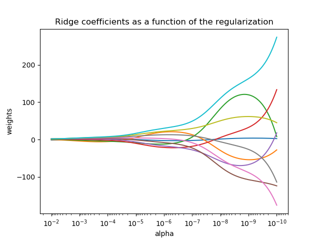

# 1.1. 广义线性模型

以下是一组用于回归的方法，其中目标值是特征值的线性组合。如果$\hat{y}$是预测值的话，用数学符号表示就是：$$\hat{y}({\omega}, x)={\omega}_0+{\omega}_1x_1+...+{\omega}_px_p$$

根据这个模型，我们指定向量${\omega}=({\omega}_1,...,{\omega})_p$作为`coef_`（一次项系数），而${\omega}_0$作为`intercept_`（截距）。

## 1.1.1. 最小二乘法

[LinearRegression](https://scikit-learn.org/stable/modules/generated/sklearn.linear_model.LinearRegression.html#sklearn.linear_model.LinearRegression)使用一组系数${\omega}=({\omega}_1,...,{\omega}_p)$来最小化数据集中的目标值的平方和，而目标值则是由线性近似得来的。数学形式是解决这个问题：$$\min_{\omega}{||X{\omega-y}||}_2^2$$


线性回归输入向量$X$以及$y$，将系数${\omega}$存进拟合函数的`coef_`成员中:

```python
from sklearn import linear_model
reg = linear_model.LinearRegression()
reg.fit([[0, 0], [1, 1], [2, 2]], [0, 1, 2])
print(reg.coef_)
```

最小二乘法估计的系数依赖于其特征的非独立性。当特征是相关的，即当矩阵$X$的列是线性相关的时候，设计矩阵变得接近于单数，结果就是最小二乘法的估计值和目标值的随机产生的错误高度相关。比如当数据是没有经过实验设计的，各种情况就会出现。

例子：
[线性回归实例](https://scikit-learn.org/stable/auto_examples/linear_model/plot_ols.html#sphx-glr-auto-examples-linear-model-plot-ols-py)

### 1.1.1.1 最小二乘法复杂度

最小二乘法是使用$X$的奇异值分解来得到解，如果$X$是一个`(n_samples, n_features)`维的矩阵，假设$n_{samples} \geq n_{features}$，那么其复杂度就是$O(n_{samples}n^2_{features})$。

## 1.1.2 岭回归

[Ridge](https://scikit-learn.org/stable/modules/generated/sklearn.linear_model.Ridge.html#sklearn.linear_model.Ridge)通过对最小二乘法的系数添加惩罚项来解决最小二乘法的一些缺陷。岭回归系数通过最小化城惩罚项的残差平法和：$$\min_{\omega}{||X{\omega}-y||}^2_2+{\alpha}{||\omega||}^2_2$$

其中复杂度参数$\alpha \geq 0$控制收缩大小，$\alpha$越大则收缩越大，因此系数对共线性的鲁棒性越好。



和其他线性模型一样，岭回归模型输入数组$X$和$y$，将线性模型的系数存在`coef_`中：

```python
from sklearn import linear_model
reg = linear_model.Ridge(alpha=5)
reg.fit([[0, 0], [0, 0], [1, 1]], [0, 0.1, 1])
print(reg.coef_)
```

例子：
[将岭系数绘制为正则化的函数](https://scikit-learn.org/stable/auto_examples/linear_model/plot_ridge_path.html#sphx-glr-auto-examples-linear-model-plot-ridge-path-py)
[使用稀疏特征对文本文档分类](https://scikit-learn.org/stable/auto_examples/text/plot_document_classification_20newsgroups.html#sphx-glr-auto-examples-text-plot-document-classification-20newsgroups-py)

### 1.1.2.1.岭回归复杂度

其复杂度和最小二乘法的复杂度一样。

### 1.1.2.2.设置正则化参数：一般性交叉验证

[RidgeCV](https://scikit-learn.org/stable/modules/generated/sklearn.linear_model.RidgeCV.html#sklearn.linear_model.RidgeCV)通过alpha参数的内置交叉验证来实现岭回归。它和`GridSearchCV`的工作方式相同，不同之处在于它默认是通用交叉验证(`GCV`)，这是一种有效的一次性交叉验证形式：

```python
import numpy as np
from sklearn import linear_model
reg = linear_model.RidgeCV(alpha=np.logspace(-6, 6, 13))
reg.fit([[0, 0], [0, 0], [1, 1]], [0, 0.1, 1])
print(reg.alpha_)
```

指定`cv`属性的值会通过交叉验证来触发交叉验证的作用，例如，`cv=10`为10次交叉验证，而不是一般性的交叉验证。

参考：

- “Notes on Regularized Least Squares”, Rifkin & Lippert ([technical report](http://cbcl.mit.edu/publications/ps/MIT-CSAIL-TR-2007-025.pdf), [course slides](https://www.mit.edu/~9.520/spring07/Classes/rlsslides.pdf)).

## 1.1.3.Lasso回归

[Lasso](https://scikit-learn.org/stable/modules/generated/sklearn.linear_model.Lasso.html#sklearn.linear_model.Lasso)是一种估计稀疏系数的线性模型。在有些场景下其是非常有用的，因为其倾向于得到更少的非零系数，尤其当解是独立且要在减少特征数量的时候。因此，Lasso及其变体是压缩传感领域的基础。在特定的条件下，它可以恢复精确的非零系数集(参照[Compressive sensing: tomography reconstruction with L1 prior (Lasso)](https://scikit-learn.org/stable/auto_examples/applications/plot_tomography_l1_reconstruction.html#sphx-glr-auto-examples-applications-plot-tomography-l1-reconstruction-py))。

数学形式上来说，它包含一个带有正则化表示的线性模型，目标最小化函数是：$$\min_{\omega}{\frac{1}{2n_{samples}}}{||X\omega - y||^2_2}+{\alpha||\omega||_1}$$

Lasso估计通过增加一个$\alpha||\omega||_1$惩罚因子来解决最小二乘问题，其中$\alpha$是一个常数，$||\omega||_1$是一个符合$l_1$-form的系数向量。

Lasso类使用时，用协调下降(coordinate descent)算法来估计系数。

```python
from sklearn import linear_model
reg = linear_model.Lasso(alpha=0.1)
reg.fit([[0, 0], [1, 1]], [0, 1])
reg.predict([1, 1])
```

函数`lasso_path`对计算更低级的任务更有效，因为它在计算系数的时候使用所有的路径。

例子：

- [在稀疏信号中使用Lasso回归和弹性网络](https://scikit-learn.org/stable/auto_examples/linear_model/plot_lasso_and_elasticnet.html#sphx-glr-auto-examples-linear-model-plot-lasso-and-elasticnet-py)
- [压缩感知：使用L1 prior进行断层扫描](https://scikit-learn.org/stable/auto_examples/applications/plot_tomography_l1_reconstruction.html#sphx-glr-auto-examples-applications-plot-tomography-l1-reconstruction-py)

小计：使用Lasso进行特征选择
因为Lasso产生稀疏的模型，因此可以用来进行特征选择，细节可参照：[L1-based feature selection](https://scikit-learn.org/stable/modules/feature_selection.html#l1-feature-selection)

参考：

- 论文：“Regularization Path For Generalized linear Models by Coordinate 
Descent”, Friedman, Hastie & Tibshirani, J Stat Softw, 2010
- 论文：An Interior-Point Method for Large-Scale L1-Regularized Least Squares,” S. J. Kim, K. Koh, M. Lustig, S. Boyd and D. Gorinevsky, in IEEE Journal of Selected Topics in Signal Processing, 2007

### 1.1.3.1.设定正则化参数

参数$\alpha$控制着估计系数的稀疏程度。

#### 1.1.3.1.1.使用交叉验证

scikit-learn通过交叉验证来展示设置过$\alpha$参数的对象：`LassoCV`和`LassoLarsCV`，`LassLarsCV`是基于下面将要解释的[最小角度回归](https://scikit-learn.org/stable/modules/linear_model.html#least-angle-regression)算法实现。

对于拥有多个共线特征的多维数据集来说，`LassoCV`是最常使用的。`LassoLarsCV`的优势在于可以发现$\alpha$的参数的更多相关值，而如果样本的量相对于特征值的数量很少的话，它就会比`LassoCV`快很多。


#### 1.1.3.1.2.基于模型选择的信息准则

另外，`LassoLarsCV`建议使用赤池信息准则(AIC)和贝叶斯信息规则(BIC)。在找$\alpha$的值的时候，它在计算上是更好的方法，因为要计算k倍交叉验证的时候，正则化路径计算的次数是1次而不是k+1次。然而这样的标准需要对解决方案的自由度进行适当的估计，导出大样本（渐进结果）并假设模型是对的，即数据实际上是由该模型生成的。当问题严重受限时，它们也倾向于破裂（即比样本有更多的特征）。


例子：

[Lasso模型选择：交叉验证/AIC/BIC](https://scikit-learn.org/stable/auto_examples/linear_model/plot_lasso_model_selection.html#sphx-glr-auto-examples-linear-model-plot-lasso-model-selection-py)

## 1.1.4.多任务Lasso

