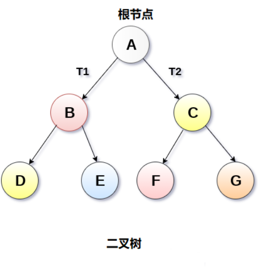
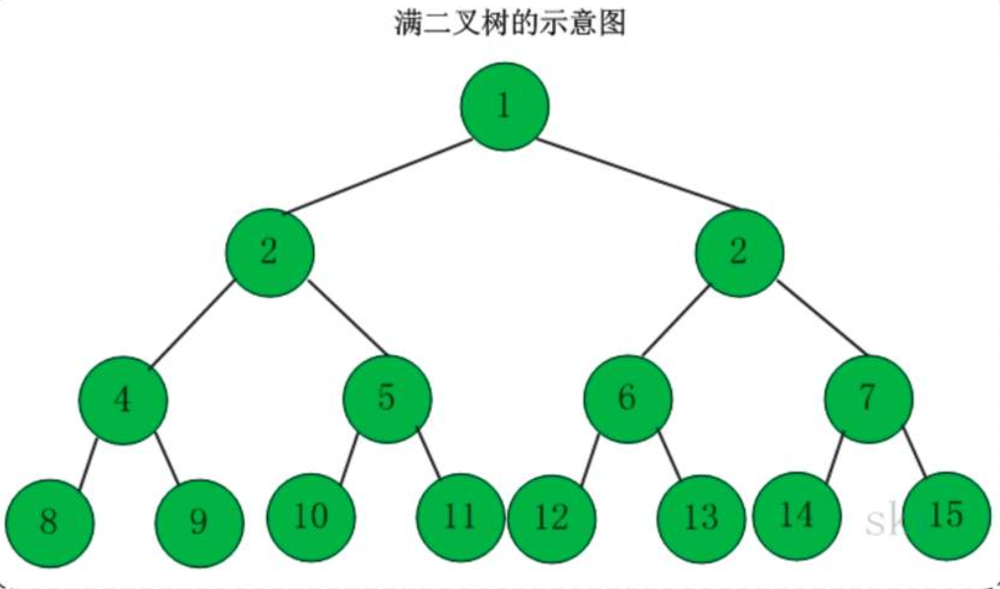
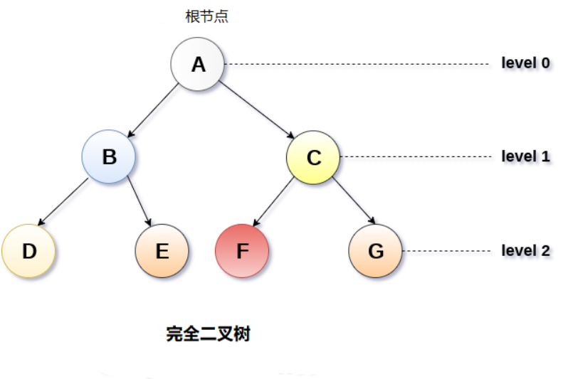
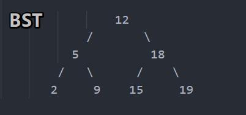
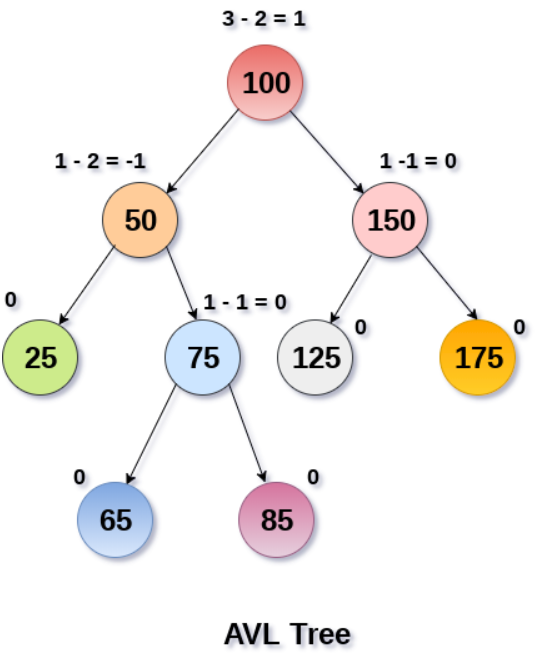
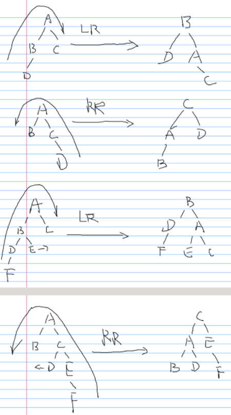
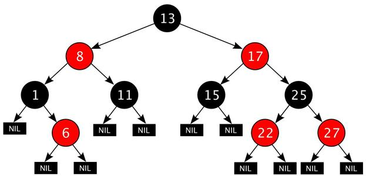
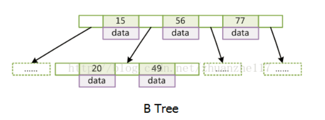
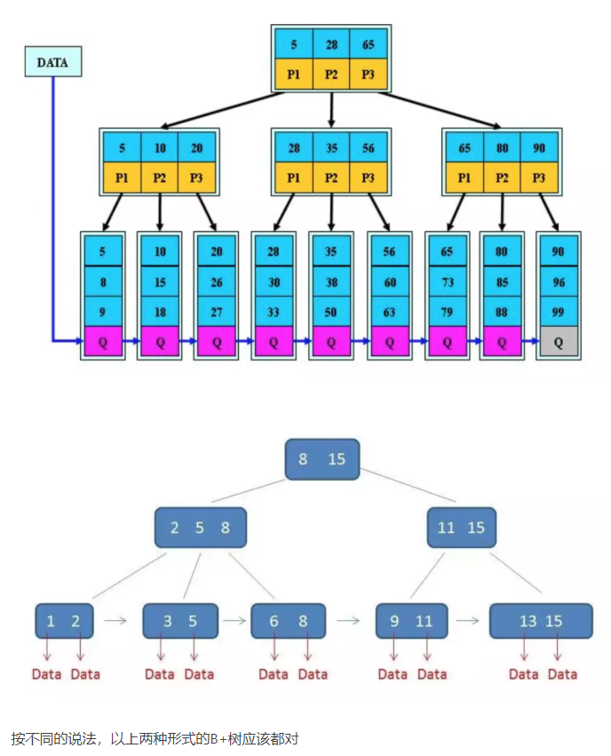
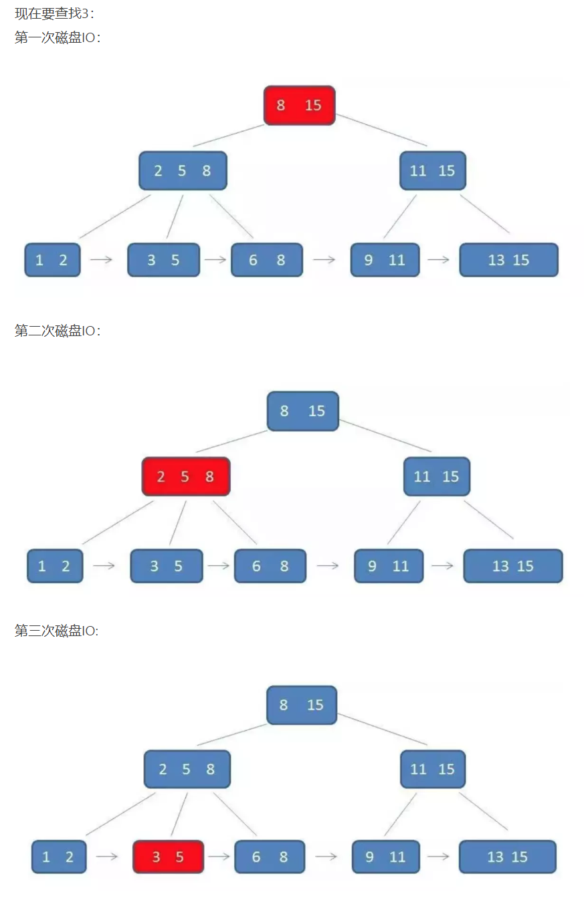

# 二叉树

<!-- vim-markdown-toc Marked -->

* [1.树](#1.树)
* [2.普通二叉树](#2.普通二叉树)
* [3.满二叉树](#3.满二叉树)
* [4.完全二叉树](#4.完全二叉树)
* [5.线索二叉树](#5.线索二叉树)
* [6.霍夫曼树(最优二叉树)](#6.霍夫曼树(最优二叉树))
* [7.二叉查找树(二叉排序树/二叉搜索树)](#7.二叉查找树(二叉排序树/二叉搜索树))
* [8.平衡二叉树(AVL树)](#8.平衡二叉树(avl树))
* [9.红黑树](#9.红黑树)
* [10.B树(多路平衡查找树)和B+树](#10.b树(多路平衡查找树)和b+树)
        - [10.1B树](#10.1b树)
        - [10.2B+树](#10.2b+树)
        - [10.3B树和B+树查询区别](#10.3b树和b+树查询区别)

<!-- vim-markdown-toc -->

参考：

- [递归算法](https://blog.csdn.net/feizaosyuacm/article/details/54919389)
- [二叉树基础](https://www.jianshu.com/p/bf73c8d50dc2)
- [二叉树的几个种类](https://www.cnblogs.com/love-yh/p/7423301.html)

## 1.树

- [树的介绍：易百教程](https://www.yiibai.com/data_structure/tree.html)

- **结点的度**
- **孩子结点**
- **兄弟结点**
- **双亲结点**

树的种类：

1. 一般树
2. 森林
3. 二叉树
4. 二叉搜索树
5. 表达树
6. 竞赛树

## 2.普通二叉树

- [普通二叉树python代码实现](./basic_binary_tree.py)

**特点：**

- 每个结点最多有两棵子树，即`结点的度不会超过2`
- `左右子树有顺序`，不能颠倒
- 即使只有一棵子树，也要区分左右子树

**性质：**

- 二叉树的`第i层最多有$2^{i-1}$个结点`($i>=1$)
- 二叉树的深度为k，则最多有`$2^k - 1$`个结点($k>=1$)
- $n0=n2+1$，其中$n0$为度数为0的结点数量，$n2$为度数2的结点数量

**应用：**

1. 二叉查找树既有链表的好处（删除和插入元素较快，但是查找很慢），又有数组的好处（查找很快，但是插入和删除元素很慢）
2. 在`处理大批量的动态数据`时候比较有用
3. `文件系统`和`数据库系统`一般都采用树（特别是B树）的数据结构

## 3.满二叉树

二叉树的所有分支结点都存在左子树和右子树，并且所有的叶子都在同一层上。

**特点：**

- 叶子结点只在最下一层
- 非叶子结点的度为2
- 同样深度的二叉树，满二叉树的结点个数最多，叶子数最多

## 4.完全二叉树

**特点：**

对一棵具有n个结点的二叉树按层编号，如果编号为i(1<=i<=n)的结点与同样深度的满二叉树中编号为i的结点在二叉树中位置完全相同，则这棵二叉树称为完全二叉树。

**性质：**

- 完全二叉树的结点为n,则深度为$log_2{n} + 1$，其中$log_2{n}$向下取整
- 完全二叉树n个结点从上至下，从左至右从1至n编号之后，则任意一个编号为i的结点具有性质：
  - i=1，该结点为根结点，无双亲, 否则，编号为`i/2`的结点为其双亲结点
  - 2i>n，该结点无左右孩子，否则，编号为`2i`的结点为其左孩子结点
  - 2i+1>n，该结点无右孩子结点，否则，编号为`2i+1`的结点为其右孩子结点

**应用：**

- [完全二叉树的应用 - 图解堆排序算法及代码实现](https://blog.csdn.net/jingangxin666/article/details/79944835)

## 5.线索二叉树

- [深入学习二叉树-线索二叉树](https://www.jianshu.com/p/3965a6e424f5)
- [彻底理解线索二叉树](https://www.cnblogs.com/lishanlei/p/10707834.html)

**特点：**

**性质：**

**应用：**

## 6.霍夫曼树(最优二叉树)

- [深入学习二叉树-霍夫曼树](https://www.jianshu.com/p/5ad3e97d54a3)

**特点：**

- 又称为`最优二叉树`
- 给定n个权值作为n个叶子节点，构造一棵二叉树，`带权路径长度达到最小`的二叉树

**应用：**

- 数据压缩和编码长度的优化

## 7.二叉查找树(二叉排序树/二叉搜索树)

- [深入学习二叉树-二叉查找树](https://www.jianshu.com/p/bbe133625c73)
- [二叉查找树python代码](./binary_search_tree.py)

**特点：**

- 具有较高的插入和删除效率较高的搜索效率
- 又称作`二叉查找树`，`二叉搜索树`

**性质：**

- `左子树不空，则左子树上节点的值均小于或等于它的根节点的值`
- `右子树不空，则右子树上节点的值均大于或等于它的根节点的值`
- `左右子树也分别为二叉查找树`

**应用：**

- 查找和插入的效率比较高

## 8.平衡二叉树(AVL树)

平衡二叉树的翻转如下：

- [平衡二叉树介绍](https://www.jianshu.com/p/fdb3c8c331f1)
- [平衡二叉树](https://blog.csdn.net/isunbin/article/details/81707606)

**特点：**

- 首先是二叉查找树，也叫`AVL树`
- `每个节点的左子树和右子树的高度至多为1`
  
**性质：**

- 左右子树都是`平衡二叉树`
- 左右子树的深度之差(`平衡因子BF`)对值不超过1
- 只要有一个节点的BF绝对值大于1，则这棵平衡二叉树失去平衡
- 查找，插入和删除操作在平均和最坏的情况下都是`O(logn)`

**应用：**

## 9.红黑树

- [红黑树介绍](https://www.cnblogs.com/xuxinstyle/p/9556998.html)
- 特殊的二叉查找树，每个结点上都存储位表示结点的颜色，红色或者黑色
- [红黑树python代码实现](./red_black_tree.py)

**特点：**

1. 每个结点为红色或者黑色
2. 根结点是黑色
3. 每个叶子结点（NIL）是黑色， **注意：这里叶子结点，是指为空(NIL或NULL)的叶子结点！**
4. 如果一个结点是红色的，则它的子结点必须是黑色的。
5. 从一个结点到该结点的子孙结点的所有路径上包含相同数目的黑结点。
6. 一棵含有n个结点的红黑树的高度至多为2log(n+1)。
7. 红黑树确保没有一条路径会比其他路径长出俩倍，因而是接近平衡的。

**性质：**

**应用：**

- 存储有序的数据，时间复杂度为O(logn)

**操作:**

1. 添加，删除，修改，查找
2. 左旋，右旋，变色，其是为了保证满足其红黑树的特性

## 10.B树(多路平衡查找树)和B+树

- [B树和B+树详细解析](https://blog.csdn.net/fhy569039351/article/details/82976842)
- [B树,B+树,B*树](https://www.jianshu.com/p/e5d86a0ba150)

### 10.1B树

- [B树介绍](https://blog.csdn.net/u010916338/article/details/86134334)
- [b树python实现](./b_tree.py)

**特点：**

- B树简单来说就是`一个节点可以拥有多于2个子节点的二叉查找树`, 也叫`多路平衡查找树`
- 最优搜索性能为$O(log_{2}N)$
- m阶B树中的m指所有节点中孩子节点树的最大值为m
- 每个非根节点的孩子节点数目j满足：$ceil(m/2)-1 <= j <= m-1$(ceil为向上取整，即大于该数的最小整数)
- `节点的子节点数会比关键字个数多1,即某节点有三个子树，则其关键字只有两个`
- 每个节点最多有m个分支，非根非叶节点最少有$ceil(m/2)$个分支

**性质：**

**应用：**

### 10.2B+树

- [b+树python实现](./b+_tree.py)

**特点：**

- B+树相对于B树就是B+树的`非叶子节点只包含导航信息，不包含实际值`
- `节点的子树个数和其关键字个数相同`
- 每个非根节点的孩子节点数目j满足：$ceil(m/2) <= j <= m-1$(ceil为向上取整，即大于该数的最小整数)
- 所有叶子节点包含了全部元素的信息，及指向含这些元素记录的指针，`叶子节点本身根据关键字的大小自小而大顺序链接`
- `所有中间节点都同时存在于子节点，在子节点是最大或者最小元素`（又不同说法）

**性质：**

**应用：**

B+树的查询过程：

### 10.3B树和B+树查询区别

- B+树的中间节点没有数据，只存储索引，所以`同样的磁盘空间可以容纳更大的节点元素`，即数据量相同的情况下，B+树更加`矮胖`，因此查询IO的次数也更少
- B+树的查询最终必须到叶子节点，B树只要找到匹配元素即可，因此`B树的性能没有B+树稳定`
