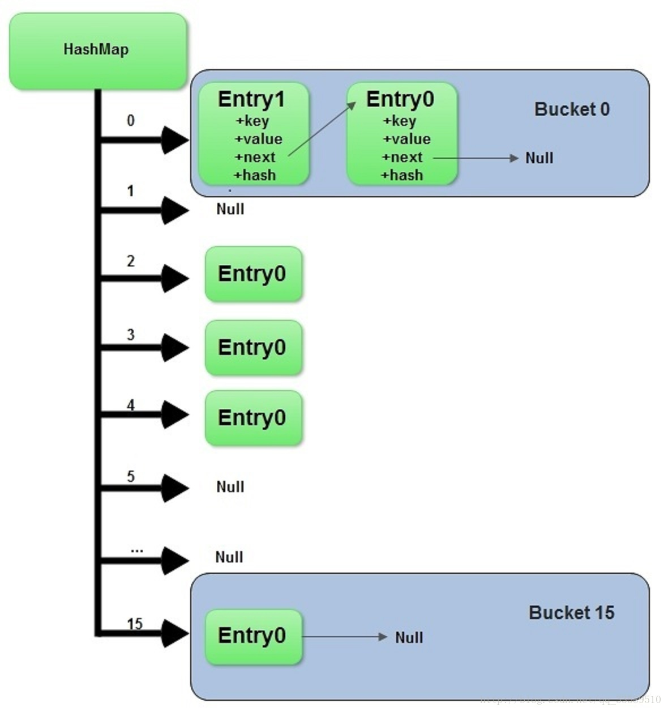

# data_structure

本文件夹主要放置一些数据结构的实现。

<!-- TOC -->

- [data_structure](#datastructure)
  - [1.链表(linked list)](#1%e9%93%be%e8%a1%a8linked-list)
    - [1.1介绍](#11%e4%bb%8b%e7%bb%8d)
    - [1.2应用场景](#12%e5%ba%94%e7%94%a8%e5%9c%ba%e6%99%af)
    - [1.3链表和数组的对比](#13%e9%93%be%e8%a1%a8%e5%92%8c%e6%95%b0%e7%bb%84%e7%9a%84%e5%af%b9%e6%af%94)
  - [2.二叉树(binary tree)](#2%e4%ba%8c%e5%8f%89%e6%a0%91binary-tree)
  - [3.霍夫曼压缩(huffman compression)](#3%e9%9c%8d%e5%a4%ab%e6%9b%bc%e5%8e%8b%e7%bc%a9huffman-compression)
    - [3.1介绍](#31%e4%bb%8b%e7%bb%8d)
    - [3.2应用](#32%e5%ba%94%e7%94%a8)
  - [4.队列(queue)](#4%e9%98%9f%e5%88%97queue)
    - [4.1优先队列(priority queue)](#41%e4%bc%98%e5%85%88%e9%98%9f%e5%88%97priority-queue)
    - [4.2双端队列(double-ended queue, dequeue)](#42%e5%8f%8c%e7%ab%af%e9%98%9f%e5%88%97double-ended-queue-dequeue)
  - [5.堆](#5%e5%a0%86)
    - [5.1介绍](#51%e4%bb%8b%e7%bb%8d)
    - [5.2应用](#52%e5%ba%94%e7%94%a8)
  - [6.栈](#6%e6%a0%88)
    - [6.1介绍](#61%e4%bb%8b%e7%bb%8d)
    - [6.2应用](#62%e5%ba%94%e7%94%a8)
  - [7.集合(set)](#7%e9%9b%86%e5%90%88set)
  - [8.哈希表(map)](#8%e5%93%88%e5%b8%8c%e8%a1%a8map)
    - [8.1介绍](#81%e4%bb%8b%e7%bb%8d)
    - [8.2常用哈希函数](#82%e5%b8%b8%e7%94%a8%e5%93%88%e5%b8%8c%e5%87%bd%e6%95%b0)
    - [8.3应用](#83%e5%ba%94%e7%94%a8)
  - [9.图(graph)](#9%e5%9b%begraph)
    - [9.1介绍](#91%e4%bb%8b%e7%bb%8d)
    - [9.2图的基本算法](#92%e5%9b%be%e7%9a%84%e5%9f%ba%e6%9c%ac%e7%ae%97%e6%b3%95)
  - [10.hash_map](#10hashmap)
    - [10.1介绍](#101%e4%bb%8b%e7%bb%8d)
  - [a.概念](#a%e6%a6%82%e5%bf%b5)
    - [a.1线性表和链表的区别](#a1%e7%ba%bf%e6%80%a7%e8%a1%a8%e5%92%8c%e9%93%be%e8%a1%a8%e7%9a%84%e5%8c%ba%e5%88%ab)

<!-- /TOC -->

- [github数据结构和算法python实现](https://github.com/TheAlgorithms/Python)

## 1.链表(linked list)

- [单链表python实现](./link_list/single_link_list.py)
- [双链表python实现](./link_list/double_link_list.py)

### 1.1介绍

`线性表`的一种，最基本，最简单，最常用的一种结构。

存储方式：

1. 顺序存储
2. 链式存储
   1. 优点是定点插入和定点删除的时间复杂度为O(1)
   2. 缺点是访问的时间复杂度最坏为O(n)

### 1.2应用场景

`线性表的长度难以，频繁的插入和删除操作，构建动态性比较强的线性表。`

### 1.3链表和数组的对比

- 数组使用方便；查询效率高，内存为一块连续的区域；但是大小固定，不适合动态存储不方便动态添加
- 可以动态添加删除，大小可变；但是只能依次指针访问，查询效率低

## 2.二叉树(binary tree)

- [二叉树](./binary_tree/binary_tree.md)

## 3.霍夫曼压缩(huffman compression)

### 3.1介绍

放弃对文本文件的普通保存方式，不再使用7位或8位二进制数表示每一个字符，而是用较少的比特表示出现频率最高的字符，用较多的比特表示出现频率低的字符。

### 3.2应用

## 4.队列(queue)

一个`FIFO（先进先出）`的数据结构，并发中使用较多，可以安全地将对象从一个任务传给另一个任务。

- 基本的队列和栈在Python中由list实现

### 4.1优先队列(priority queue)

优先队列中的每个元素都有各自的优先级，优先级高的元素先获得服务；优先级相同的元素根据其在优先队列中的顺序获得服务。

- Python中通过`heapq`库来实现优先队列

### 4.2双端队列(double-ended queue, dequeue)

可以在任何一端添加或者移除元素，是具有队列和栈性质的数据结构。

- python中，为提高效率，使用collections库，`collections.dqueue()`

## 5.堆

### 5.1介绍

- 通常指`二叉堆`，物理结构为数组，逻辑结构为完全二叉树
- 根节点最大的堆为最大堆或者大根堆，根节点最小的堆为最小堆或者小根堆
- `常被用作实现优先队列`

### 5.2应用

## 6.栈

栈是一种`LIFO(Last In First Out)`的数据结构，常用方法有添加元素，取栈顶元素，弹出栈顶元素，判断栈是否为空。

- [栈的实现以及其他类型的栈](https://blog.csdn.net/wenqiang1208/article/details/77193449)
- [栈的python实现](./stack/stack.py)

### 6.1介绍

**特点**:

- 先进后出，后进先出(LIFO)

**类型**:

- 共享栈，其实就是一个数组
- 链式栈，通过节点构成的单链表构成

### 6.2应用

- 括号匹配
- 十进制表示N进制
- 行编辑

## 7.集合(set)

用于保存不重复元素的数据结构。

- python自带的类型

## 8.哈希表(map)

### 8.1介绍

- 基本思想是以关键字为自变量，通过函数（散列函数或者哈希函数），计算出对应的函数值（哈希地址），以这个值作为数据元素的地址，并将数据元素存入到相应地址的存储单元。
- [哈希表Python实现](./hashing/hash_table.py)

### 8.2常用哈希函数

1. `除留余数法`，H(key)=key%p
2. `直接地址法`，H(key=a*key+b
3. `数字分析法`
4. `平方取中法`
5. `折叠法`

### 8.3应用

实现字典操作的一种有效的数据结构。

## 9.图(graph)

### 9.1介绍

- [数据结构:图](https://www.jianshu.com/p/bce71b2bdbc8)
- [小白学数据结构:图，基本概念已经Python实现](https://blog.csdn.net/qq_33414271/article/details/78516443)
- [数据结构经典面试题:图](https://www.jianshu.com/p/9e280bfbaf57)

**图的表示：**

- `邻接矩阵`，由行和列决定的矩阵对应元素表示这里两个定点是否相连，如果相连，这该元素的值表示相连的权重，(易于实现但是对于稀疏矩阵会浪费较多空间)
- `邻接表`，每个定点存储一个**从它这里开始的边**的列表，(使用链表存储，但是图搜索的时间复杂度较高)，**相对使用较多**。

**图的种类：**

- `有向图`，边有方向之分
- `无向图`，所有的边都不区分方向

**相关概念：**

- `度`，关联该点的边的数目
- `权`，指每条边所具有的权重
- `连通图`，无向图中每个顶点从其他的顶点都是可达的

### 9.2图的基本算法

1. 图的遍历
2. 单源最短路径
3. 拓扑排序
4. 最下生成树

## 10.hash_map

### 10.1介绍

- [hashmap看这篇就够了](https://www.nowcoder.com/discuss/151172)

- 基于hash表实现，每一个元素是一个key-value对，内部通过单链表解决冲突问题，容量不足仍会增长
- 非线程安全，只适用于单线程环境
- 支持序列化，支持克隆
- java中的hashmap对应python中的dict

hashmap本质是`链表散列的`的数据结构，即`数组和链表的结合体`。java8中为数组+链表+红黑树。

## a.概念

### a.1线性表和链表的区别

- [单链表和顺序表的关系](./imgs/difference_between_sll_and_ol.png)
