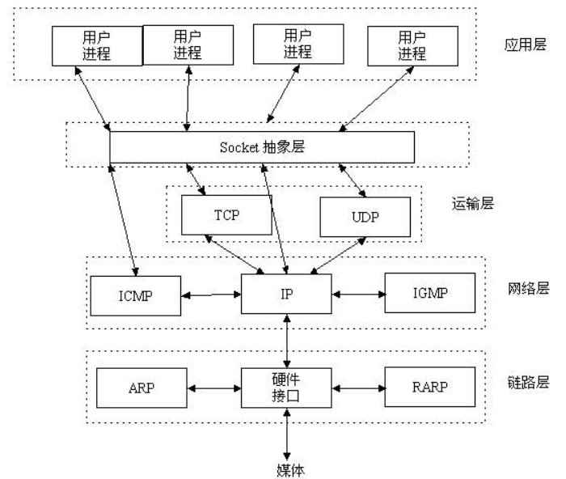

# 网络面试

<!-- TOC -->

- [网络面试](#%e7%bd%91%e7%bb%9c%e9%9d%a2%e8%af%95)
  - [1.HTTP](#1http)
    - [1.1介绍](#11%e4%bb%8b%e7%bb%8d)
    - [1.2GET和POST](#12get%e5%92%8cpost)
    - [1.3Keep-Alive模式](#13keep-alive%e6%a8%a1%e5%bc%8f)
    - [1.4cookie，session和token](#14cookiesession%e5%92%8ctoken)
      - [1.4.1cookie](#141cookie)
      - [1.4.2session](#142session)
      - [1.4.3token](#143token)
    - [1.5同源策略及跨域解决方案](#15%e5%90%8c%e6%ba%90%e7%ad%96%e7%95%a5%e5%8f%8a%e8%b7%a8%e5%9f%9f%e8%a7%a3%e5%86%b3%e6%96%b9%e6%a1%88)
      - [1.5.1同源策略](#151%e5%90%8c%e6%ba%90%e7%ad%96%e7%95%a5)
      - [1.5.2跨域限制](#152%e8%b7%a8%e5%9f%9f%e9%99%90%e5%88%b6)
    - [1.6http1.0,http1.1与http2.0之间的区别](#16http10http11%e4%b8%8ehttp20%e4%b9%8b%e9%97%b4%e7%9a%84%e5%8c%ba%e5%88%ab)
  - [2.HTTPS](#2https)
    - [2.1介绍](#21%e4%bb%8b%e7%bb%8d)
    - [2.2SSL证书](#22ssl%e8%af%81%e4%b9%a6)
  - [3.TCP与UDP](#3tcp%e4%b8%8eudp)
    - [3.1介绍](#31%e4%bb%8b%e7%bb%8d)
    - [3.2三次握手，四次挥手](#32%e4%b8%89%e6%ac%a1%e6%8f%a1%e6%89%8b%e5%9b%9b%e6%ac%a1%e6%8c%a5%e6%89%8b)
    - [3.3tcp/udp使用场景](#33tcpudp%e4%bd%bf%e7%94%a8%e5%9c%ba%e6%99%af)
    - [3.4tcp粘包](#34tcp%e7%b2%98%e5%8c%85)
  - [4.缓存](#4%e7%bc%93%e5%ad%98)
    - [4.1缓存介绍](#41%e7%bc%93%e5%ad%98%e4%bb%8b%e7%bb%8d)
    - [4.2浏览器缓存](#42%e6%b5%8f%e8%a7%88%e5%99%a8%e7%bc%93%e5%ad%98)
  - [5.授权](#5%e6%8e%88%e6%9d%83)
    - [5.1OAuth2.0](#51oauth20)
  - [6.安全](#6%e5%ae%89%e5%85%a8)
    - [6.1csrf(跨站请求伪造)](#61csrf%e8%b7%a8%e7%ab%99%e8%af%b7%e6%b1%82%e4%bc%aa%e9%80%a0)
    - [6.2xss(跨站脚本攻击)](#62xss%e8%b7%a8%e7%ab%99%e8%84%9a%e6%9c%ac%e6%94%bb%e5%87%bb)
    - [6.3sql注入](#63sql%e6%b3%a8%e5%85%a5)
    - [6.4ddos攻击](#64ddos%e6%94%bb%e5%87%bb)
  - [7.Restful规范](#7restful%e8%a7%84%e8%8c%83)
    - [7.1restful中相关概念](#71restful%e4%b8%ad%e7%9b%b8%e5%85%b3%e6%a6%82%e5%bf%b5)
    - [7.2对restfule的理解](#72%e5%af%b9restfule%e7%9a%84%e7%90%86%e8%a7%a3)
    - [7.3相关规范](#73%e7%9b%b8%e5%85%b3%e8%a7%84%e8%8c%83)
  - [8.socket编程](#8socket%e7%bc%96%e7%a8%8b)
  - [常见面试题](#%e5%b8%b8%e8%a7%81%e9%9d%a2%e8%af%95%e9%a2%98)
    - [web框架的本质](#web%e6%a1%86%e6%9e%b6%e7%9a%84%e6%9c%ac%e8%b4%a8)

<!-- /TOC -->

- [github后端面试网络相关](https://github.com/yongxinz/back-end-interview/tree/master/%E7%BD%91%E7%BB%9C#1%e4%b8%89%e6%ac%a1%e6%8f%a1%e6%89%8b%e5%92%8c%e5%9b%9b%e6%ac%a1%e6%8c%a5%e6%89%8b)
- [100个网络基础知识普及](https://blog.csdn.net/devcloud/article/details/101199255)

## 1.HTTP

### 1.1介绍

- 基于TCP/IP，应用层协议，默认端口为80
- `无状态`(对于交互式场景没有记忆)，`无连接`(限制每次连接只处理一个请求，且请求完成断开连接)

### 1.2GET和POST

- [知乎:GET和POST的区别](https://www.zhihu.com/question/31640769?rf=37401322)

条件GET：如果客户端重新请求的这段时间内，服务端的页面没有改变，则应该使用浏览器缓存的数据。根据客户端的请求头：

```text
If-Modified-Since:Thu, 4 Feb 2010 20:39:13 GMT
```

服务端根据该字段的时间，如果当前的响应内容没有改变，则返回`304 Not Modified`,客户端使用缓存内容。

### 1.3Keep-Alive模式

非该模式下的时候，每一次请求都要建立一次连接；该模式(持久连接)下，可以使连接持续有效，避免下次请求的时候需要重新建立连接。

### 1.4cookie，session和token

- [cookie和session的简单使用](https://blog.csdn.net/weixin_42808295/article/details/81290306)
- [彻底理解cookie,session,token](https://www.liangzl.com/get-article-detail-16019.html)

**cookie和session的出现都是为了对http协议的无状态的扩展。**

#### 1.4.1cookie

- 浏览器按照域名进行存储，A网站的cookie只会返回到A网站
- `临时cookie`在浏览器关闭则消失；`长久cookie`是设置了有效期，浏览器关闭不会消失，而是到了有效期才消失
- cookie主要用来存储用户的登录信息或者选购商品页面跳转的时候知道选购的信息

缺陷：

- cookie增加了网络流量
- cookie是明文传输，安全性的不到保障
- cookie传输大小有限制(4kb),储存的信息量有限

#### 1.4.2session

- session存储在服务器端，`依赖于cookie`，通常根据存在cookie中的session id(可以经过算法加密)来找到对应的session
- 每次验证的用户发送请求时，服务器储存信息，导致占用过多资源，同时可扩展性也不强
- 默认有效时间为30分钟

**使用cookie和session保存用户登录状态：**

1. 浏览器第一次请求服务器
2. 服务器收到请求，返回携带sessionid的cookie，同时服务器保存session
3. 浏览器第二次请求服务器，携带cookie，服务器根据cookie中的sessionid找到对应的session

#### 1.4.3token

- [深入理解token](https://www.cnblogs.com/xuxinstyle/p/9675541.html)
- [python产生token以及token的验证方法](https://www.jb51.net/article/153525.htm)
- [阮一峰:json web token入门教程](http://www.ruanyifeng.com/blog/2018/07/json_web_token-tutorial.html)

**介绍**:

- `令牌`，服务端生成的一串字符串，作为客户端请求的标识
- token可以发在cookie里面，但是这样不能解决跨域问题
- token做好发在请求头`Authorization`里面

**作用**：

- 完全由应用管理，可以避开`同源策略`(同源指两个页面的协议，端口和域名都相同，同源策略指不同源的客户端脚本在没有明确授权的情况下不可以读写对方的资源)
- 可以避免CSRF攻击
- 可以是无状态的，可以在多个服务器之间共享
- 可以减轻服务器压力，减少频繁查询数据库

### 1.5同源策略及跨域解决方案

- [同源策略及跨域解决方案](https://www.cnblogs.com/rain-chenwei/p/9520240.html)
- [浏览器同源策略及跨域的解决方法](https://www.cnblogs.com/laixiangran/p/9064769.html)

#### 1.5.1同源策略

- web构建于同源策略，是最基本最核心的浏览器安全功能，即执行web页面脚本的时候会检查脚本是属于哪个页面(协议，域名，端口)
- 分类:`DOM同源策略`，`XMLHttpRequest同源策略`

#### 1.5.2跨域限制

- 浏览器同源策略的存在导致跨域限制，为了保证用户网络安全

**跨域问题解决**：

1. CORS(跨域资源共享)，W3C的标准，基本思想是 `使用自定义的HTTP头部决定浏览器与服务器沟通`，简单请求需要origin字段
   1. 优点：通信与同源ajax相同，代码相同易维护
   2. 缺点：存在一定的兼容性问题，非简单请求首次请求需要两次请求
2. JSONP跨域，基本思想是`script标签不受浏览器同源策略影响`
   1. 优点：最流行，使用方便，没有兼容性问题
   2. 缺点：只适用GET方法，安全性有一定问题
3. 图像Ping跨域，基本思想是`img标签不受同源策略影响`
   1. 优点：实现跟踪用户点击
   2. 缺点：只适用GET，只能浏览器与服务器的单向通信
4. 服务器代理，基本思想是`服务器不存在跨域问题`
   1. document.domain跨域
   2. window.name跨域
   3. location.hash跨域
   4. postMessage跨域

### 1.6http1.0,http1.1与http2.0之间的区别

- [http1.0,http1.1与http2.0之间的区别](https://blog.csdn.net/qq_36183935/article/details/81156225)
- [http1.0,http1.1与http2.0之间的区别2](https://blog.csdn.net/linsongbin1/article/details/54980801)

| 协议 | 特点 |
| ---- | --- |
| http1.0 | 1、无状态；<br>2、无连接 |
| http1.1 | 1、持久连接；<br>2、请求管道化，响应必须按照请求的顺序；<br>3、增加缓存处理；<br>4、增加host字段，支持断点续传 |
| http2.0 | 1、二进制分帧(对数据标识，不会乱序)；<br>2、多路复用(一个tcp连接建立无数个http请求)；<br>3、请求头头部压缩减少带宽消耗；<br>4、服务器可以在无明确请求的时候推送数据到客户端 |

## 2.HTTPS

### 2.1介绍

- [HTTPS基础介绍](https://blog.51cto.com/11883699/2160032)
- [白话https加密机制](https://www.cnblogs.com/jymblog/p/11646766.html)

基于`TLS`或者`SSL`提供加密处理数据，在加密信道进行HTTP内容传输的协议。

- 通信的过程：采用对称加密进行通信
- 协商通信的过程：采用非对称加密解决对协商过程的加密（应为相对而言，非对称加密的耗时较长）
  - 非对称加密使用的公钥获取依赖`SSL证书(需要购买)`和`CA机构`

### 2.2SSL证书

包括颁发机构，有效期，公钥，证书持有者，签名。

1. 浏览器校验证书中的颁发者，有效期等
2. 浏览器查找本地内置的受信任的证书颁发机构，与之对比，校验是否合法
3. 不合法说明证书不可信；合法则使用相同的hash算法进行解密签名
4. 读取证书中的公钥，进行后续加密

**证书获取**：

- 向一些云服务商申请，获取得到该CA机构的文件(`.CSR`)
- 其中KEY文件，为对应的server端的私钥（`丢失无法找回`）

**配置https**：

[阿里云SSL配置Apache,nginx等](https://help.aliyun.com/video_detail/54216.html?spm=a2c4g.11186623.4.1.WbwjQN)

```nginx
"nginx新增配置项"
listen 443 ssl;
ssl_certificate     /iyunwen/server/ssl/20180731.cer;
ssl_certificate_key /iyunwen/server/ssl/20180731.key;
ssl_prefer_server_ciphers on;
ssl_session_timeout 10m;
ssl_session_cache shared:SSL:10m;
ssl_protocols TLSv1 TLSv1.1 TLSv1.2;
ssl_ciphers "EECDH+ECDSA+AESGCM EECDH+aRSA+AESGCM EECDH+ECDSA+SHA384 EECDH+ECDSA+SHA256 EECDH+aRSA+SHA384 EECDH+aRSA+SHA256 EECDH+aRSA+RC4 EECDH EDH+aRSA !aNULL !eNULL !LOW !3DES !MD5 !EXP !PSK !SRP !DSS !RC4";
```

## 3.TCP与UDP

### 3.1介绍

**tcp**:

- 面向连接，可靠（`但也不是100%，实际是数据的可靠传递和故障的可靠通知`）
- 使用`校验和`，`确认`和`重传`机制来保证可靠传输
- 对数据分节进行排序，并使用累积确认保证数据的顺序不变和非重复

**udp**:

- 非可靠，不提供确认，序列号，超时重传等机制
- 数据包的长度有限
- 无连接
- 支持多播和广播

### 3.2三次握手，四次挥手

`三次握手`指客户端和服务端首次建立连接的时候需要发送三个包：

1. 客户端发送`SYN`标志位为1的包，指明需要连接的服务器的端口以及初始序号X，客户端处于`SYN_SEND`状态
2. 服务端发送`ACK`确认包应答，SYN和ACK标志位均为1，服务端处于`SYN_RCVD`状态
3. 客户端发送`ACK`确认应打包，SYN标志位为0，ACK标志位为1，客户端进入`ESTABLISHED`状态

`tcp标志位`,有6种标示：[tcp标志位详解](https://blog.csdn.net/chenvast/article/details/77978367)

`四次挥手`指tcp连接的拆除，需要发送四个包：

1. 客户端发送`FIN`标志位为1的包，表示自己无数据发送，但可以接收数据
2. 服务端发送`ACK`包，表示自己收到关闭连接的请求，但未准备好关闭
3. 服务端发送`FIN`标志位为1的包，表示自己结束连接
4. 客户端发送`ACK`确认收到服务端的关闭请求

### 3.3tcp/udp使用场景

- udp提供的无状态的连接，适合语音，直播，视频等
- tcp面向连接，适合文件传输，远程登录等

### 3.4tcp粘包

- [什么是TCP粘包以及如何解决](https://blog.csdn.net/weixin_41047704/article/details/85340311)

原因：

1. 当连续发送数据时候，TCP的nagle算法将较小的内容拼接为大的内容，一次性发送，造成粘包;
2. 发送的数据较大时，服务端的buff_size较小，不能一次性接收所有的内容，下次请求到达时候接收的是上次没有完全接收完的东西，造成粘包。

## 4.缓存

### 4.1缓存介绍

- [缓存介绍](https://juejin.im/post/5a6c87c46fb9a01ca560b4d7)
- [你应该知道的缓存进化史](https://juejin.im/post/5b7593496fb9a009b62904fa#comment)
- [如何优雅的设计和使用缓存](https://juejin.im/post/5b849878e51d4538c77a974a)
- `保存资源副本并在下一次请求时候直接使用该副本。`

**缓存优点**：

- 不用每次去请求资源，缓解服务器压力
- 因为是打开本地资源，所以提升了性能
- 减少了带宽消耗

**缓存分类**：

- 宏观
  - `私有缓存`: 用户专享的，各级代理不能缓存的缓存
  - `共享缓存`：能被各级代理缓存的缓存
- 微观
  - `浏览器缓存`
  - `代理服务器缓存`
  - `网关缓存`
  - `数据库缓存`

### 4.2浏览器缓存

- [浏览器缓存机制](https://www.cnblogs.com/skynet/archive/2012/11/28/2792503.html)

`通过响应头告知浏览器该资源是否应该缓存`

- `Expires`: 告知客户端资源缓存失效的绝对时间
- `Cache-Control`：控制缓存的行为
- `Last-Modified`：资源最后一次修改的时间
- `ETag`: 服务器生成资源的唯一标识

## 5.授权

### 5.1OAuth2.0

- [阮一峰:OAuth2.0简单解释](http://www.ruanyifeng.com/blog/2019/04/oauth_design.html)

OAuth2.0的四种方式:

1. `授权码`，第三方应用先申请一个授权码，然后利用授权码获得令牌，最常用，且安全性高
2. `隐藏式`，适用于纯前端应用，直接向前端颁发令牌，省略了授权码步骤
3. `密码式`，对于高度信任的应用，直接将用户名以及密码告诉第三方应用
4. `凭证式`，适用于没有前端的应用，直接在命令行下申请令牌

## 6.安全

### 6.1csrf(跨站请求伪造)

- [常见web攻击手段之csrf](https://www.jianshu.com/p/67408d73c66d)

防御手段：

- cookie设置为http-only
- 提交数据使用post而不是get
- 增加token
- 验证请求头中的referer值，referer记录请求的来源网站

### 6.2xss(跨站脚本攻击)

- [xss攻击详解](https://blog.csdn.net/qq_36119192/article/details/82469035)

### 6.3sql注入

### 6.4ddos攻击

## 7.Restful规范

- [阮一峰:理解restful架构](http://www.ruanyifeng.com/blog/2011/09/restful.html)
- [restful规范以及架构](http://www.imooc.com/article/details/id/265729)

`restful本质上是一种网站即软件思想下的架构设计规范。`

### 7.1restful中相关概念

- `Representational State Tranfer,(资源)表现层状态转换`
- 资源就是网络中的一个实体，图片，文字等，用url来标识，`上网就是和这些资源互动，调用其url`
- 表现层指对资源的呈现形式，如文字可以是txt，html或者二进制
- 客户端与服务端交互过程中数据和状态的转化

### 7.2对restfule的理解

- 每一个url代表一种资源
- 客户端和服务端传递这种资源的表现层
- 客户端通过四个HTTP动词(get,post,put,delete)来操作资源，实现表现层状态转化

### 7.3相关规范

1. api与用户通信的规范使用https
2. 尽量将api部署到专用的域名之下，如:api.example.com
3. api路径(url)中不能有动词，且名词使用复数
4. 记录数量过多，提供过滤信息的参数
5. 避免多级url,使用查询字符串代替
6. 状态码以及返回值都指定特殊的格式

## 8.socket编程

`socket = ip_address + tcp/udp + port`



## 常见面试题

### web框架的本质

[web框架的本质以及自定义简单web框架](https://www.cnblogs.com/wanghzh/p/5807883.html)

- web应用的本质就是socket服务端，浏览器就是socket客户端
- python的web框架遵循相同的WSGI标准，从而可以互相配和使用
