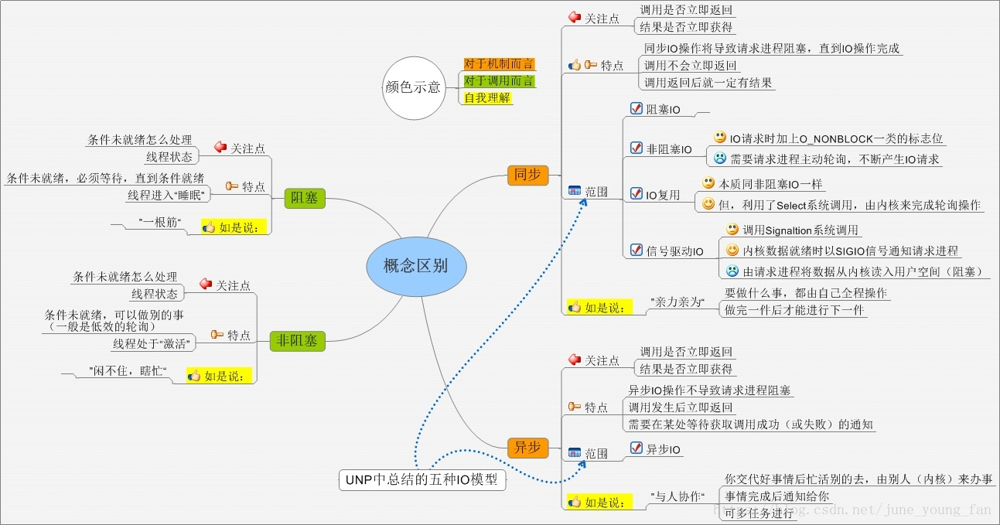

# web面试

<!-- vim-markdown-toc Marked -->

* [1.web框架](#1.web框架)
        - [1.1Django](#1.1django)
        - [1.2Tornado](#1.2tornado)
        - [1.3Flask](#1.3flask)
* [2.正则表达式](#2.正则表达式)
* [3.第三方登录](#3.第三方登录)
        - [3.1qq第三方登录](#3.1qq第三方登录)
* [4.网络I/O模型](#4.网络i/o模型)
        - [4.1网络I/O](#4.1网络i/o)
        - [4.2五种网络I/O模型](#4.2五种网络i/o模型)
                + [4.2.1阻塞I/O(blocking I/O)](#4.2.1阻塞i/o(blocking-i/o))
                + [4.2.2非阻塞I/O(nonblocking I/O)](#4.2.2非阻塞i/o(nonblocking-i/o))
                + [4.2.3多路复用I/O(I/O multiplexing)](#4.2.3多路复用i/o(i/o-multiplexing))
                + [4.2.4信号驱动I/O(signal driven I/O)](#4.2.4信号驱动i/o(signal-driven-i/o))
                + [4.2.5异步I/O(asynchronous I/O)](#4.2.5异步i/o(asynchronous-i/o))
* [5.多进程与多线程](#5.多进程与多线程)
* [6.异步任务](#6.异步任务)
* [7.第三方SDK集成](#7.第三方sdk集成)
* [8.高并发](#8.高并发)
        - [8.1提升系统并发能力](#8.1提升系统并发能力)
        - [8.2高并发指标](#8.2高并发指标)
        - [8.3python解决高并发](#8.3python解决高并发)
        - [8.4并发模型](#8.4并发模型)
                + [8.4.1多线程编程模型](#8.4.1多线程编程模型)
                + [8.4.2Callback编程模型](#8.4.2callback编程模型)
                + [8.4.3Actor编程模型](#8.4.3actor编程模型)
                + [8.4.4CSP编程模型](#8.4.4csp编程模型)
* [a.其他](#a.其他)
        - [a.1web项目环境](#a.1web项目环境)

<!-- vim-markdown-toc -->

- [大型网站架构设计以及性能优化](../books/大型网站技术架构核心原理与案例分析/website_structure.md)

## 1.web框架

### 1.1Django

- [django详细介绍](../introductions/network/framework/django_introduction.md)

### 1.2Tornado

- [tornado详细介绍](../introductions/network/framework/tornado_introduction.md)

### 1.3Flask

- [flask详细介绍](../introductions/network/framework/flask_introduction.md)

## 2.正则表达式

- [python使用re模块](../python/modules/re/re_module.py)
- [python面试之正则表达式模块](https://www.cnblogs.com/angle6-liu/p/10830512.html)
- [python正则表达式常见面试题](https://blog.csdn.net/wangbowj123/article/details/77979635)
- [正则表达式测试工具](http://tool.oschina.net/regex)

**常用的正则表达式匹配规则如下**：

| 模式 | 描述 |
| :---: | :--- |
| . | 表示匹配除了换行符之外的任意字符 |
| ^ |(脱字符)匹配输入字符串的起始位置 |
| $ |(美元符号)匹配输入字符串的结束位置 |
| \| | a\|b，表示匹配a或b |
| \ | 将普通字符转为特殊字符，如\d表示任意十进制数字，\\.表示匹配点号本身 |
| * | 匹配前面的子表达式零次或多次，等价于{0,} |
| + | 匹配前面的子表达式一次或多次，等价于{1,} |
| ? | 匹配前面的子表达式零次或一次，等价于{0,1} |
| {m,n} | m<=n，且均为非负整数，表示前面的RE表达式匹配m~n次，{m}表示匹配m次，{m,}表示至少匹配m次，{,n}表示需要匹配最多匹配n次 |
| () | 匹配括号内的表达式，也表示一个组 |
| [ ] |匹配括号内包含的任意一个字符，出现连字符-在中间则表示字符范围描述，首位出现^表示不匹配不包含其中的任意字符   |
| \n | 匹配一个换行符 |
| \t | 匹配一个制表符 |
| \d | 匹配任意十进制数字，等价于[0-9] |
| \D | 匹配任意非数字的字符 |
| \w | 匹配字母，数字，下划线 |
| \W | 匹配不是字母，数字，下划线的字符 |
| \s | 匹配任意空白字符，等价于[\t\n\r\f] |
| \S | 匹配任意非空字符 |
| \z | 匹配字符串结尾，如果存在换行，同时还会匹配换行符 |
| \Z | 匹配字符串结尾，如果存在换行，只匹配换行符前的结束字符串 |
| \A | 匹配字符串开头 |

**常用修饰符**:

| 修饰符 | 描述 |
| :---: | :--- |
| re.S(常用) | 使.匹配包括换行在内的所有字符 |
| re.X(常用) | 该标志通过给予你更灵活的格式以便你将正则表达式写得更易于理解 |
| re.I | 使匹配对大小写不敏感 |
| re.L | 做本地化识别(locale-aware)匹配 |
| re.M | 多行匹配，影响^和$ |
| re.U | 根据Unicode字符集解析字符。这个标志影响\w、\W、 \b和\B |

## 3.第三方登录

### 3.1qq第三方登录

- [qq第三方登录过程详解](https://blog.csdn.net/a992970569/article/details/82107899)

1. 获取Authorization Code
2. 获取Access Token
3. 获取Open Id,可以与账号绑定

## 4.网络I/O模型

- [五种网络I/O模型](https://blog.csdn.net/bob_dadoudou/article/details/79476588)

### 4.1网络I/O

- `网络I/O的本质就是读取socket流。`

过程(两个阶段)：

1. 等待网络分组数据到达，复制到`内核(kernel)的缓冲区`
2. 从内核将数据复制到`用户进程(process)`

### 4.2五种网络I/O模型

- [并发编程，I/O多路复用](https://www.cnblogs.com/cainingning/p/9556642.html)



#### 4.2.1阻塞I/O(blocking I/O)

- 最简单的模型，两个阶段的操作都是阻塞的
- 数据没准备好，进程处于等待状态

**应用场景**：

#### 4.2.2非阻塞I/O(nonblocking I/O)

- 数据没有到达的时候，进程read不到，马上返回一个结果，结果为error则说明数据没有准备好，再次read,直至read到
- 只在进程处理的第一阶段不阻塞

**应用场景**：

#### 4.2.3多路复用I/O(I/O multiplexing)

- 最简单的解释就是`一个进程同时为多个客户端服务`
- 常说的`select, poll, epoll`模型
- 进程在两个阶段(等待和处理)都是block住等待的
- 优势在于使用较少的代价同时监听多个I/O

**常用I/O复用模型：**

- `select`，各个客户端的文件描述符(套接字，socket)维护在一个集合中，select函数监视这些这些文件描述符中哪些可读，如果可读则会让工作进程去读取，`最多维持1024个连接`
- `poll`，区别于select就是`存放集合的数据结构不同`，可以`连接任意个连接`
- `epoll`，select和poll都是通过`轮询的方式`来查找是否有可读和可写，`epoll是基于内核的反射机制`，当有活跃的socket的时候，会提前调用设置好的回调函数

**应用场景**：

#### 4.2.4信号驱动I/O(signal driven I/O)

- 信号驱动异步模型
- 内核准备好数据通知进程，`通知何时启动一个I/O操作`
- 优势在于内核准备好数据通知进程的期间，进程不会堵塞

**应用场景**：

#### 4.2.5异步I/O(asynchronous I/O)

- 进程两个阶段都不会阻塞
- linux中无真正的I/O
- `内核同时I/O操作何时完成`

**应用场景**：

## 5.多进程与多线程

- [多进程和多线程的应用场景](https://blog.csdn.net/qq_16209077/article/details/52769609)
- [多进程多线程以及协程的区别和不同的应用场景](https://blog.csdn.net/someonei/article/details/79598311)

**多维度对比：**

| 对比维度 | 多进程 | 多线程 | 总结 |
| ------- | :----- | :----- | :--- |
| `数据共享，同步` | 1.数据共享复杂，需要IPC；<br>2.数据同步简单，因为数据是分开的 | 1.数据共享，共享简单；<br>2.因为数据共享，所以同步复杂 | 各有优势 |
| `内存，cpu` | 内存占用高，切换复杂，CPU利用率低 | 占用内存少，切换简单，CPU利用率高 | 线程占优 |
| 创建销毁，切换 | 创建销毁及切换复杂，速度慢 | 创建销毁及切换简单，速度快 | 线程占优 |
| 编程，调试 | 编程及调试简单 | 编程及调试均复杂 | 进程占优 |
| 可靠性 | 进程间不相互影响，可靠性高 | 一个线程挂掉则整个进程挂掉，可靠性低 | 进程占优 |
| 分布式 | 适合多核，多机，扩展简单 | 适合多核 | 进程占优 |

**场景总结：**

- `多线程`
  - 频繁的创建以及销毁场景，如web服务器
  - 需要大量使用CPU运算的，如图像处理，算法相关的
  - 强相关的处理，即任务之间的关联很强
  - 多核的分布式
  - `python解释器(Cpython)中的GIL的存在使得多线程不能发挥作用,但是Jpython解释器没有GIL`
- `多进程`
  - 弱相关的处理
  - 需要扩展到多机的分布式
- `多协程`
  - 协程的切换只是单纯操作CPU上下文，协程在一个线程内，属于并发
  - `I/O密集型`的任务

## 6.异步任务

- [Django使用celery异步发送短信](https://www.jianshu.com/p/062235710d43)

## 7.第三方SDK集成

- [手把手教你集成微信，支付宝支付功能SDK](https://www.jianshu.com/p/925394737c9e)

## 8.高并发

`高并发`指的是系统能够同时并行处理多个请求。

参考:

- [Python高并发详解](https://www.cnblogs.com/daofaziran/p/10154986.html)

### 8.1提升系统并发能力

1. **垂直扩展**
   1. 增加单机硬件性能,更好的cpu, ssd, 更大的内存
   2. 提升单机架构性能，减少cache来减少IO次数，使用异步来增加单服务吞吐量
2. **水平扩展**
   1. 增加服务器的数量
   2. 反向代理层：通过DNS轮询，`dns-server对于一个域名配置多个解析ip,每次DNS解析请求来访问dns-server，会轮询返回ip`
   3. 站点层：通过`改nginx.conf，单台机器上配置多个web后端`
   4. 服务层：通过`服务连接池`实现，站点层的RPC-client与下游服务建立多个连接，服务成为瓶颈的时候，只要增加服务器数量即可
   5. 数据层：`主从同步`，按照数据范围或数据hash的方式来提升系统的性能等

### 8.2高并发指标

- 响应时间
- 吞吐量
- 每秒查询率
- 并发用户数

### 8.3python解决高并发

1. HTML`页面静态化`
2. 图片服务器分离
3. 使用`缓存`(使用redis作为缓存的数据库)
4. 数据库`集群`，库表散列
5. 使用`负载均衡`
6. 镜像网站，CDN加速等

```nginx
<!-- 简单的负载均衡nginx配置 -->
upstream myserver {
    server 192.168.72.49:8080;
    server 192.168.72.49:8081;
}
```

### 8.4并发模型

#### 8.4.1多线程编程模型

**特点**：

- 多个相互独立的执行流
- 共享内存
- 抢占式调度
- 依赖锁，信号量等同步机制

**易出现问题**：

- 死锁，活锁
- 资源耗尽
- 优先级反转

#### 8.4.2Callback编程模型

- 常常用于`异步事件`
- 函数A在函数B没有被调用的情况下就先返回结果，在某个异步事件发生时候再执行回调函数

#### 8.4.3Actor编程模型

- 属于并发组件模型
- 区别于传统多线程之间通过共享内存和同步机制来防止写争夺，Actors使用消息模型
- 每个Actors在同一时间只处理一个消息，可以发送消息到其他的Actors，保证了单独写，避免多线程的资源争夺

#### 8.4.4CSP编程模型

- 分为两个模块：`Processor`(代表任务执行的顺序单元，内部无并发)和`Channel`(代表信息流之间的信息交互，如共享数据的交换，修改等)
- Processor之间解耦合，工作者之间不直接通信，工作者向不同的通道中发送消息，其他工作者监听这些通道的消息

## a.其他

### a.1web项目环境

- 开发环境(development)
- 集成环境(integration)
- 测试环境(testing)
- QA验证环境
- 模拟环境(staging)，用来给客户做演示，是生产环境的镜像
- 生产环境(production)
