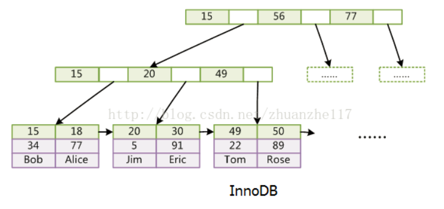
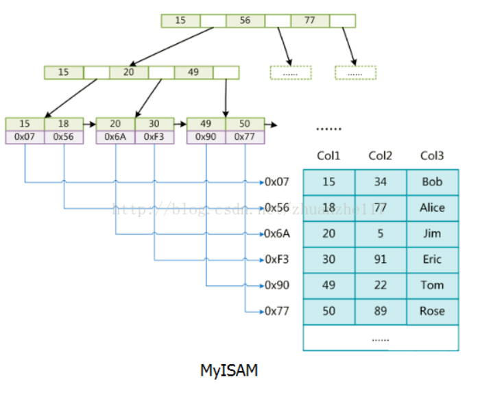

# mysql数据库

<!-- vim-markdown-toc Marked -->

* [1.介绍](#1.介绍)
        - [1.1基本知识](#1.1基本知识)
        - [1.2数据类型](#1.2数据类型)
                + [1.2.1json](#1.2.1json)
        - [1.3基准测试](#1.3基准测试)
* [2.索引](#2.索引)
        - [2.1基础介绍](#2.1基础介绍)
        - [2.2索引类型](#2.2索引类型)
        - [2.3高性能索引策略](#2.3高性能索引策略)
        - [2.4判断索引是否被使用](#2.4判断索引是否被使用)
        - [2.5查询不会使用索引的情况](#2.5查询不会使用索引的情况)
* [3.事务](#3.事务)
        - [3.1事务介绍](#3.1事务介绍)
        - [3.2事务隔离级别](#3.2事务隔离级别)
                + [3.2.1锁](#3.2.1锁)
                + [3.2.2锁的类型](#3.2.2锁的类型)
                + [3.2.3锁的粒度](#3.2.3锁的粒度)
                + [3.2.4死锁](#3.2.4死锁)
                + [3.2.5乐观锁和悲观锁](#3.2.5乐观锁和悲观锁)
        - [3.3事务隔离级别](#3.3事务隔离级别)
        - [3.4 MVCC(多版本并发控制)](#3.4-mvcc(多版本并发控制))
        - [3.5mysql事务](#3.5mysql事务)
* [4.存储引擎](#4.存储引擎)
        - [4.1InnoDB](#4.1innodb)
                + [4.1.1基本介绍](#4.1.1基本介绍)
                + [4.1.2innodb索引](#4.1.2innodb索引)
        - [4.2MyISAM](#4.2myisam)
        - [4.3mysql支持存储引擎及其区别](#4.3mysql支持存储引擎及其区别)
* [5.表结构](#5.表结构)
        - [5.1表结构切分](#5.1表结构切分)
        - [5.2表结构设计](#5.2表结构设计)
                + [5.2.1主键](#5.2.1主键)
                + [5.2.2NULL与NOT NULL](#5.2.2null与not-null)
                + [5.2.3用户密码散列用什么类型存储](#5.2.3用户密码散列用什么类型存储)
        - [5.3分库分表](#5.3分库分表)
* [6.mysql相关命令](#6.mysql相关命令)
        - [6.1安装启动等](#6.1安装启动等)
        - [6.2数据库操作相关命令](#6.2数据库操作相关命令)
        - [6.3数据表操作相关命令](#6.3数据表操作相关命令)
        - [6.4数据操作相关命令](#6.4数据操作相关命令)
                + [6.4.1CRUD基本操作](#6.4.1crud基本操作)
                + [6.4.2索引基础](#6.4.2索引基础)
                + [6.4.3创建计算字段](#6.4.3创建计算字段)
        - [6.5用户以及权限操作相关命令](#6.5用户以及权限操作相关命令)
                + [6.5.1用户管理](#6.5.1用户管理)
                + [6.5.2权限管理](#6.5.2权限管理)
        - [6.6字符集相关操作](#6.6字符集相关操作)
                + [6.6.1查看已经设定的字符集](#6.6.1查看已经设定的字符集)
                + [6.6.2设置字符集](#6.6.2设置字符集)
* [7.性能和优化](#7.性能和优化)
        - [7.1基本介绍](#7.1基本介绍)
        - [7.2查询性能优化](#7.2查询性能优化)
        - [7.3数据类型优化](#7.3数据类型优化)
        - [7.4范式和反范式](#7.4范式和反范式)
* [8.数据类型](#8.数据类型)
        - [8.1整数类型](#8.1整数类型)
        - [8.2实数类型](#8.2实数类型)
        - [8.3字符串类型](#8.3字符串类型)
        - [8.4日期和时间类型](#8.4日期和时间类型)
        - [8.5位数据类型](#8.5位数据类型)
        - [8.6选择标示符](#8.6选择标示符)
        - [8.7特殊类型数据](#8.7特殊类型数据)
* [7.其他](#7.其他)
        - [7.2视图](#7.2视图)
        - [7.3几个写sql的好习惯](#7.3几个写sql的好习惯)
                + [7.3.1sql性能优化](#7.3.1sql性能优化)
                + [7.3.2sql后悔药](#7.3.2sql后悔药)
                + [7.3.3sql规范](#7.3.3sql规范)
* [x.面试](#x.面试)
        - [x.1char与varchar的区别](#x.1char与varchar的区别)
        - [x.2varchar10与int10的区别](#x.2varchar10与int10的区别)
        - [x.3binlog的录入方式与区别](#x.3binlog的录入方式与区别)
        - [x.4超大分页的处理](#x.4超大分页的处理)
        - [x.5业务中sql的耗时以及慢查询优化](#x.5业务中sql的耗时以及慢查询优化)
        - [x.6横向分表和纵向分表的例子](#x.6横向分表和纵向分表的例子)
        - [x.7什么是存储过程及其优缺点](#x.7什么是存储过程及其优缺点)
        - [x.8范式](#x.8范式)
        - [x.9mybatis中的`#`与`$`的区别](#x.9mybatis中的`#`与`$`的区别)
        - [x.10E-R图](#x.10e-r图)
        - [x.11mysql单表多次查询与多表联合查询效率对比](#x.11mysql单表多次查询与多表联合查询效率对比)

<!-- vim-markdown-toc -->

## 1.介绍

### 1.1基本知识

- [mysql详细教程](http://c.biancheng.net/view/2409.html)
- [本地mysql读书笔记](../../books/mysql必知必会/mysql_known.md)
- [github中mysql知识点](https://github.com/DavidWhom/CS-Notes-Learning/blob/master/notes/MySQL.md)
- 可以嵌入到应用程序中，可以支持: `数据仓库`，`内容索引`和`部署软件`,`高可用的冗余系统`，`在线事务处理系统`等。
- 最大的特性是其`存储引擎架构`，将查询处理和其他系统任务以及数据的存储/提取相分离

**关键名词及其类比：**

```sh
database=一个仓库
dba=仓库管理员
schema=仓库下的一个房间，一个schema代表一个房间
user=房间管理员，拥有schema的管理权限，一个房间管理员可以拥有多个房间。
table=房间里的储物柜
columns=储物柜里的列
rows=储物柜里的行
data=就是存储在储物柜里面的物品了
```

### 1.2数据类型

#### 1.2.1json

- [json数据类型查询](https://www.cnblogs.com/sxdcgaq8080/p/10876745.html)

```sh
# scores是json格式的查询
select * from user where JSON_CONTAINS(scores, '[4, 3]');  # scores同时包含4和3的
```

### 1.3基准测试

- 针对系统设计的一种压力测试
- 测试指标：`吞吐量（单位时间事务处理数量），响应时间，并发性，可扩展性`
- 测试工具：`ab, http_load, JMeter`

## 2.索引

### 2.1基础介绍

- 索引是存储引擎用于快速查找到记录的`数据结构`
- mysql索引默认使用B+树，节点中key从左到右非递减排序
- 索引是在存储引擎层实现，不同存储引擎具有不同的索引类型和实现。
- [mysql索引背后的数据结构和算法](http://blog.codinglabs.org/articles/theory-of-mysql-index.html)

**优点：**

1. 加快了记录的查询,减少需要扫描的行数
2. 帮助服务器避免排序和临时表
3. 将随机I/O变为`顺序I/O`

**缺点：**

- 占用了额外的储存空间
- 因为需要维护，减慢了插入以及更新记录速度

**使用条件：**

1. 对于非常小的表,大部分情况全表扫描比建立索引效果更好
2. `中大型的表使用索引`
3. 特大型的表可以使用`分区技术`

**建立索引考虑要素：**

- 字段使用频率高的适合作为索引
- 联合索引(即多个字段的索引)还需要考虑联合索引中的顺序

### 2.2索引类型

- `B+树索引`
    -  - 大多数`默认索引`
    - 底层实现是`多路平衡查找树`，查找从根节点(根节点的槽中存储了指向子节点的指针)出发，比较节点页的值找到合适的指针(定义了子节点页的上下限)到下层节点, 下层节点到叶子节点(指针指向的是被索引的数据)得到键值，至找到记录
    - InnoDB中：`默认使用主键建立聚簇索引`；没有主键使用唯一键建立聚簇索引；没有唯一键，隐式的生成一个键建立聚簇索引
- `哈希索引`
    - 底层`实现就是hash表`，调用一次hash函数就可以找到键值，然后由键值表找到记录
    - 只包含哈希值和行指针，而不存储数据值
    - 等值查询较快，但是性能不稳定；不是按照索引顺序存储的，不支持使用索引进行排序，不支持模糊查询
- `联合索引`
    - 同时使用多个字段建立的索引叫作联合索引
    - 联合索引想要命中需要按照建立索引的顺序挨个使用，否则无法命中索引
- `全文索引`
    - 查找文本中的关键词
- `空间数据索引`

### 2.3高性能索引策略

1. 独立的列，即索引不能是表达式的一部分或者函数的参数(eg:`select actor_id from actors where actor_id + 1 = 5;`将不能使用actor_id列的索引)
2. 多列索引，为每一个列都单独创建索引并不高效，
3. 索引列的顺序，针对多列索引，准则为：`将选择性最高的列放在索引的最前列`
4. 前缀索引和索引选择性，索引长字符串(blob, text, 长的varchar)会让索引慢和大，可以只索引字符串的前一部分
5. 覆盖索引，一个索引包含所有需要查询的字段值
6. `聚簇索引`，叶一种数据存储方式，子节点只存储了当前的key值，类似于数据行和相邻的键值紧凑的存储在一起, 可以将相关的数据保存到一起，索引较快; 非聚簇索引：叶子节点存储了当前的key值以及整行的数据
7. 冗余和重复索引，允许创建，但是需要单独维护，应该避免
8. 未使用的索引，用不到应该删除,使用特定的工具分析
9. 索引可以让查询使用更少的行

### 2.4判断索引是否被使用

- explain分析sql语句执行计划可以得到是否使用索引
- [mysql的explain语句详解](https://www.cnblogs.com/tufujie/p/9413852.html)

### 2.5查询不会使用索引的情况

- 使用不等于查询
- 列参与了数学运算
- 其他

## 3.事务

### 3.1事务介绍

- 事务是一系列不可分割的操作，要么全部成功，要么全部失败

需要符合四个特征：

1. `原子性(A)`,即要么全部成功，要么全部失败
2. `一致性(C)`,即db只会从一个一致性状态到另一个一致性状态，不会有中间态
3. `隔离性(I)`,即一个事务在执行完成之前对其他事务是不可见的
4. `持久性(D)`,即事务一旦提交，不会改变

### 3.2事务隔离级别

事务隔离级别的产生是为了控制并发，随着事务隔离级别的升高，数据出现不一致性的可能性降低，但是性能下降。

- `未提交读`：事务中没有提交的修改对其他事务是可见的，因此可能造成`脏读`,较少使用
- `提交读`：直到事务提交，否则所有修改其他的事务不可见，也叫`不可重复读`，因为有时候两次查询会有不同的结果（该事务执行前后）
- `可重复读`：解决脏读问题，保证了同一事务多次读取的数据一致性，可能产生`幻读`（事务一读取范围内数据，事务二在该范围插入数据，事务一再次读取产生幻行）,此为`mysql的默认隔离级别`
- `可串行化`，最高级别，强制事务串行执行

#### 3.2.1锁

当数据读取与数据写入产生冲突的时候，锁产生。

#### 3.2.2锁的类型

1. `读锁`，属于`共享锁`，可以多个同时存在，因为多个读取操作不会产生冲突
2. `写锁`，属于`排他锁`，会排斥其他的读锁或者写锁

#### 3.2.3锁的粒度

锁的粒度即`锁作用的范围`，因为数据的读取和写入如果不是同一个数据的时候，频繁加锁会影响性能。

1. `表锁`，开销最小
    - 对整张表加锁，写锁会阻塞其他用户的操作，读锁不阻塞
2. `行级锁`，开销很大
    - 对操作的数据行加锁，可以最大程度的支持并发
    - 只在存储引擎层实现

#### 3.2.4死锁

- 死锁是一种状态的描述
- 两个操作占有自己的`资源不释放`，然后请求对方的资源造成的状态
- 解决方式：**Innodb将持有最少行数排他锁(写锁)的事务进行回滚来打破。**

```sh
<!--产生的死锁的一个场景：两个事务都执行了第一条更新语句，锁定了该行数据，但是执行第二条时候，发现数据被对方锁定，就等待对方释放锁，产生死锁-->
<!--事务1-->
start transaction;
update student set age=10 where id=1;
update student set age=20 where id=2;
commit;

<!--事务2-->
start transaction;
update student set score=80 where id=2;
update student set score=95 where id=1;
commit;
```

#### 3.2.5乐观锁和悲观锁

- [mysql乐观锁介绍](https://blog.csdn.net/aodaidi6752/article/details/101595344)
- [mysql悲观锁总结和实践](https://www.iteye.com/blog/chenzhou123520-1860954)

**乐观锁：**

- 假设认为数据一般情况下不会发生冲突，所以在数据提交更新的时候才会去检查是否冲突
- 如果冲突了就会返回错误信息，让用户决定怎么做

**悲观锁：**

- 认为数据一般情况下会发生冲突，所以在整个数据处理的过程中都会将数据锁定，不被外界锁修改

### 3.3事务隔离级别

**事务的实现会增加性能开销，事务隔离级别是对事务实际情况选取不同的策略，从而提高性能。**

事务隔离级别种类：

1. `未提交读`，使用较少，即`未提交就可以读`，其他事务可以看到本事务没有提交的更改，可能会造成`脏读`，即读取到的数据是不正确的脏数据
2. `已提交读`，其他事务只能读取到本次事务提交的部分，存在`不可重复读`的问题，[mysql事务的不可重复读演示](https://blog.csdn.net/nangeali/article/details/75578605)
3. `可重复读`，`Innodb默认级别`，解决了不可重复的的问题，但是可能会产生`幻读`问题，[mysql可重复读现象已经原理](https://www.2cto.com/database/201807/763885.html)
4. `可串行化`，最高的隔离级别，较少使用，强制将所有的操作串行化，导致并发性能下降

### 3.4 MVCC(多版本并发控制)

- 相对于锁的另一种控制并发的方式，核心思想是为每一条数据加两个版本号:`数据的删除版本号`和`数据的当前版本号`

### 3.5mysql事务

- mysql默认是自动提交，即每个语句后面一个提交，可以通过设置`autocommit`关闭

```sh
# 开启事务
start transaction;

# 回滚,将事务之前的步骤取消
rollback;

# 提交事务
commit;
```

## 4.存储引擎

### 4.1InnoDB

#### 4.1.1基本介绍

- mysql默认的事务性存储引擎
- 实现了四个标准的隔离级别：[mysql innodb四个事务隔离级别](https://blog.csdn.net/wangzhiguo9261/article/details/80999492)
  - `可重复读(默认)`,并通过间隙锁策略来防止幻读
  - 提交读
  - 未提交读
  - 串行化
- `支持真正的在线热备份`
- 主要用来处理大量的`短期事务`,采用MVCC来支持高并发

#### 4.1.2innodb索引

- 

- data存储的是数据本身
- 索引也是数据
- 数据和索引都存储在`*.IDB`文件中，所以叫`聚簇索引`，该索引对主键查询有很好的性能，但是二级索引中必须包含主键列，所以如果主键列很大的话，其他的索引都会很大

### 4.2MyISAM



- data存储的是数据地址
- 索引和数据分开
- 索引放在`*.MYI`文件，数据放在`*.MYD`文件，所以叫`非聚集索引`

**特点：**

- 提供了大量特性: 压缩表，空间数据索引等
- 不支持事务
- 不支持行级锁

### 4.3mysql支持存储引擎及其区别

| 存储引擎 | 事务 | 锁 | MVCC | 外键 | 全文索引 |
| -------- | ---- | -- | ---- | ---- | -------- |
| InnoDB | 支持 | 支持行级锁 | 支持  | 支持 | 不支持 |
| Myisam | 不支持 | 支持表级锁 | 不支持 | 不支持 | 支持 |
| Memory |  |  |  |  |  |
| Archive |  |  |  |  |  |

## 5.表结构

### 5.1表结构切分

- 水平切分, 将同一个表中的记录拆分到多个结构相同的表中
- 垂直切分, 将一个表按列切分为多个表，通常按照列的关系密集程度进行切分

### 5.2表结构设计

#### 5.2.1主键

- 保证数据行的唯一性
- 尽量使用自增长id而不是uuid,innodb中主键索引作为聚簇索引，如果是自增id,叶子节点排序时只要依次就行，减小开销
- [14个实用的数据库设计技巧(知乎)](https://zhuanlan.zhihu.com/p/82338929

#### 5.2.2NULL与NOT NULL

- [为什么mysql列属性尽量使用NOT NULL](https://www.cnblogs.com/sherlockwhite/p/why_not_null.html)
- NULL使得索引、索引的统计信息以及比较运算更加复杂。你应该用0、一个特殊的值或者一个空串代替空值。

#### 5.2.3用户密码散列用什么类型存储

- 密码散列,盐,用户身份证号等固定长度的字符串应该使用char而不是varchar来存储,这样可以节省空间且提高检索效率

### 5.3分库分表

- [csdn:如何进行分库分表](https://blog.csdn.net/wdcl2468/article/details/10291160)

## 6.mysql相关命令

### 6.1安装启动等

```sh
# mysql命令(linux系统):
sudo apt-get install mysql-server  # 安装mysql服务器
sudo apt-get install mysql-client  # 安装mysql客户端
sudo apt-get install libmysqlclient-dev  # 安装mysql客户端其他相关

ps aux | grep mysql  # 查看mysql的进程是否启动
sudo service mysql start  # 开启mysql
sudo service mysql stop  # 关闭mysql
sudo service mysql restart  # 重启mysql
sudo service mysql status  # 查看服务状态

# 连接到数据库进行操作
mysql -h(ip地址,默认为localhost) -P(端口号,默认为3306) -uroot -p(密码,可输可先不输)

# 更改登录密码
use user;
update user set authentication_string="123456" where User="root";
flush privileges;
# 然后重启mysql，登录

# 忘记root密码,修改my.conf，加上字段
# [mysqld]
# skip-grant-tables
# 就可以免密码登录
# 然后修改密码

# 将整个数据库导出
mysqldump -u root -p db_name > db_name.sql

# 导出数据库的一张表
mysqldump -u root -p db_name table_name > table_name.sql

# 执行sql文件,导入数据库
use db1;
source /home/xxx.sql;
```

### 6.2数据库操作相关命令

```sh
# 创建数据库:
create database db1;
create database db1 character set utf8  # 创建指定字符集的数据库
create database db1 charset utf8  # 创建指定字符集的数据库,简写
alter database db1 charset utf8  # 修改已经创建的数据库的字符集

# 查看数据库:
show databases;
show create database db1;  # 查看创建数据库的过程

# 使用数据库:
use db1;  # 只有这一句后面可以增加或者不加;
select database();  # 查询当前使用的数据库

# 删除数据库:
drop database db1;

# 使用dump备份数据库
mysqldump -h 127.0.0.1 -p 3306 -uroot -p123456 --database db > /data/db.sql  # 备份整个testdb数据库
mysqldump -h 127.0.0.1 -p 3306 -uroot -p123456 --database db | gzip > /data/db.sql  # 整个testdb数据库,但是进行压缩,防止文件过大
mysqldump -h 127.0.0.1 -p 3306 -uroot -p123456 --database db t1 t2 > /data/db.sql  # 备份数据库的多张表
mysqldump -h 127.0.0.1 -p 3306 -uroot -p123456 --databases db1 db2 > /data/dbs.sql  # 备份一个实例的多个数据库
mysqldump -h 127.0.0.1 -p 3306 -uroot -p123456 --all-databases > /data/db.sql  # 备份实例上的所有数据库
```

### 6.3数据表操作相关命令

```sh
# 数据表操作:
# 创建表:
create table tab1(id int, name char(10));
create table tab1(id int(5), name char(10));
create table tab1(c1 int, c2 int, KEY(c1));   # 创建表并在c1列建立索引

# 查看表:
show tables;
show create table tab1;  # 查看创建表的过程
desc tab1;  # 清晰的查看表的结构
show table status like 'tab1';  # 查看表的信息，包括存储引擎，版本，行数，占用大小，更新时间等

# 显示表列
show columns from tab1;

# 修改表:
alter table tab1 rename to tab2;  # 修改表tab1的名字为tab2
alter table tab1 add age int;  # 追加一个整型字段age
alter table tab1 modify column number varchar(100);  # 修改字段number的数据类型为varchar
alter table tab1 change id number int(5);  # 更改字段名id为number, 同时要说明类型
alter table tab1 modify column number default null;  # 修改字段number默认可以为空

# 删除表:
alter table tab1 drop age;  # 删除指定字段，删除列
alter table tab1 drop column age  # 删除质指定字段，删除列
drop table tab1;  # 删除整张表

# 检查表状态，是否有损坏,索引是否有错误等
check table tab1;
# 修复表，可能部分存储引擎不支持
repair table tab1;
```

### 6.4数据操作相关命令

#### 6.4.1CRUD基本操作

```sh
# 从表中查询所有的数据:
select * from tab1;
select id, name, age from tab1;  # 指定显示的列
select distinct age from tab1;  # 只返回不同的值
select age from tab1 limit 10;  # 指定返回前10行

# 数据显示排序
select name, age from tab1 order by age;  # 按年龄排序
select name, age from tab1 order by age desc;  # 按年龄降序排序

# 插入数据:
insert into tab1 values(1, 'tom');  # 向所有字段插入一条数据,需要一一对应
insert into tab1(name,id) values('jim',2);  # 向指定多个字段插入数据,需要一一对应
insert into tab1(id,name) values(3,'mary'),(4,'tony'),(5,'sam');  # 向指定字段插入多条数据

insert into tab1(id) values(2);  # 向指定单个字段插入一条数据, 推荐


# 修改数据:
update tab1 set id=5;  # 将字段中所有的值更改
update tab1 set id=5 where name='tom';  # 有条件的修改字段中所有的值

# 删除数据:
truncate tab1;  # 直接删除,不可恢复
delete from tab1 where name='tony';  # 指定条件删除,部分情况可通过回滚来恢复
delete from tab1;  # 不指定条件删除
```

#### 6.4.2索引基础

索引设计的原则：

1. 最适合索引的列是出现在WHERE子句和连接子句中的列。
2. 索引列的基数越大（取值多重复值少），索引的效果就越好。
3. 使用前缀索引可以减少索引占用的空间，内存中可以缓存更多的索引。
4. 索引不是越多越好，虽然索引加速了读操作（查询），但是写操作（增、删、改）都会变得更慢，因为数据的变化会导致索引的更新，就如同书籍章节的增删需要更新目录一样。
5. 使用InnoDB存储引擎时，表的普通索引都会保存主键的值，所以主键要尽可能选择较短的数据类型，这样可以有效的减少索引占用的空间，利用提升索引的缓存效果。

```sh
# 创建索引
create index name on tab1(name);  # 创建最简单的索引
create index index1 on tab1(name(20));

# 查看索引
show index from tab1;

# 删除索引
drop index1 from tab1;
```

#### 6.4.3创建计算字段

- 存储在表中的数据不是应用所需要或者能直接使用的，`计算字段是从数据库中检索出转换，计算或者格式化的数据，不实际存在于数据库表中，而是在运行select语句的时候创建的`。

```sh
# 创建计算字段，经name和age拼接为 name(age) 格式,注意空格
select Contat(name, ' (', age, ')') from tab1;
select Contat(name, ' (', age, ')') as title from tab1;  # 创建计算字段并设置别名

# 创建执行计算的计算字段
select price*numbers as total_price from tab1;

# 汇总数据
# 汇总平均数
select Avg(price) as avg_price from tab1;

# 计算最大值
select Max(price) as max_price from tab1;

# 分组数据
# 通过年龄分组
select name from tab1 group by age;
```

### 6.5用户以及权限操作相关命令

#### 6.5.1用户管理

```sh
# 用户管理:
# 避免非开发用户误操作.
# 查看所有用户 MySQL中所有的用户及权限信息都存储在MySQL数据库的user表中

# 查看所有用户:
select host, user, authentication_string from user;

# 添加用户并分配权限
# https://blog.csdn.net/xudejun/article/details/84779442
use mysql;
create user tonyliu@localhost identified by "123456";
flush privileges;

# 删除用户:
drop user "liu"@"localhost";
```

#### 6.5.2权限管理

- [mysql权限详解](https://blog.csdn.net/BlingZeng/article/details/89351946)
- [mysql grant用户权限总结](https://blog.csdn.net/anzhen0429/article/details/78296814)

```sh
# 查看权限:
show grants for 用户名@主机地址
show grants for liu@localhost

# 修改权限:
grant 权限名称 on 数据库 to 账户@主机 with grant option;
grant all privileges on *.* to "liu"@"localhost" with grant option;  # 赋予该用户所有数据库的权限
flush privileges;  # 刷新权限

# 当使用orm连数据库,仍有权限问题的时候,需要修改用户的密码并重启mysql
ALTER USER 'root'@'localhost' IDENTIFIED WITH mysql_native_password BY 'new-password';
```

### 6.6字符集相关操作

- mysql的utf8不是真正的utf8，utf8mb4才是真正的utf8

#### 6.6.1查看已经设定的字符集

```sh
# 查看mysql支持的字符集
show charset;

# 查看数据库服务器和数据库字符集
show variables like '%character%';

# 查看指定数据库的字符集
show create database test_db;

# 查看表的字符集
show create table test_table;
show table status from test_tb like "test_table";

# 查看表中所有列的字符集
show full columns from test_table;
```

#### 6.6.2设置字符集

```sh
# 创建数据库的时候设置字符集
create database test_db default character set="utf8mb4";
# 创建表的时候设置字符集
create table test_table(id int(6), name char(10)) default character set="utf8mb4";

# 修改库的字符集
alter database test_db default character set "utf8mb4";
# 修改表的字符集
alter table test_table convert to character set "utf8mb4";
# 修改字段的字符集
alter table test_table modify test_field char(10) character set "utf8mb4";
```

## 7.性能和优化

### 7.1基本介绍

- 性能一般指响应时间

### 7.2查询性能优化

**使用Explain分析：**

- [mysql explain详解](https://www.cnblogs.com/xiaoqiang-code/p/11404149.html)
- 使用explain,模拟优化器执行SQL语句，分析查询语句或是结构的性能瓶颈

explain结果字段分析：

1. `type`：访问类型，包括：`ALL（全表扫描）`、`index（索引全扫描）`、`range（索引范围扫描）`、`ref（非唯一索引扫描）`、`eq_ref（唯一索引扫描）`、const/system、NULL。在所有的访问类型中，很显然ALL是性能最差的，它代表了全表扫描是指要扫描表中的每一行才能找到匹配的行
2. `possible_keys`：可以选择的索引，但是有可能不会使用
3. `key`：真正使用的索引
4. `rows`：查询需要扫描的行数，一个预估值

```sh
# 检查该语句的执行情况
explain select * from table1;
```

**利用慢查询日志分析：**

- 可以在业务高峰期记录慢查询，然后分析，可使用工具`pt-query-digest`

1. 优化数据访问
    - 减少请求的数据量, 只返回必要的列和行; 缓存重复查询的数据
    - - 减少服务端扫描的行数
    - - 最有效的方式是使用索引来覆盖查询
2. 重构查询方式
    - 切分大查询
    - - 分解大连接查询

### 7.3数据类型优化

- 更小的数据类型(数据正确的前提下)
- 简单的数据类型，eg: 整数相对于字符串
- 避免NULL,其使`索引，索引统计值以及值比较都更难，且占用更多的存储空间`，最好`使用NOT NULL或者0或者空字符串`等, 尤其在列上建索引的时候要避免NULL
- 避免使用太多的列，从行缓冲的编码过的列转换为行数据结构的成本很高
- 避免太多的关联，单个查询关联的表尽量不超过12
- 防止过度使用枚举('0', '1', ... '31')

### 7.4范式和反范式

范式化数据表示方法：

- 在`写密集的场景`使用效果较好
- 优点：更新操作相对于反范式通常更快；数据符合范式时数据很少或者没有重复数据；表更小，因此操作更快；检索列表时更少使用distinct或group by
- 缺点：查询时通常需要关联，有时候代价更高，索引策略更难处理

反范式数据表示方法：

- 优点：很好的避免表关联，数据比内存大的时候可能比关联快，因为可`避免随机I/O`，单独的表可以更有效的使用索引策略
- 常见的反范式化的方法是：复制和缓存，在不同的表中存储相同的特定列

**实际中，最好要范式和反范式化的shema，缓存表和其他技巧混用。**

## 8.数据类型

### 8.1整数类型

可选参数unsigned(无符号类型), 如：tinyint unsigned 范围为0-255，tinyint范围为：-128-127

1. 整数

- tinyint(8位)
- smallint(16位)
- mediumint(24位)
- int(32位)
- bigint(64位)

### 8.2实数类型

- decimal
- float(4Byte)
- double(8Byte)

### 8.3字符串类型

- varchar，不定长，用于存储可变长字符串，仅使用必要的存储空间
- char，定长，

### 8.4日期和时间类型

- year
- date
- datetime，范围为1001-9999年，精度为秒，占用8个字节
- timestamp，保存时间戳，占用4个字节，保存的值一定，但是显示的值依赖于时区

如果想存储比秒更小粒度的时间，可以使用bigint.

### 8.5位数据类型

- bit，在一列中存储一个或者多个true/false值，mysql将其作为字符串类型
- set，需要保存多个true/false值

### 8.6选择标示符

最好使用整数作为标示列。

### 8.7特殊类型数据

- ip地址，无符号整数存储
- 精确到毫秒的时间，bigint

## 7.其他

### 7.2视图

视图的定义：

- 视图是关系型数据库中将一组查询指令构成的结果集组合成可查询的数据表的对象
- 视图即`虚拟的表`，但与数据表不同的是，数据表是一种实体结构，而视图是一种虚拟结构
- 视图理解为`保存在数据库中被赋予名字的SQL语句`，不包含数据，所以每次使用时候都会重新查询以获得数据，所以在使用复杂的视图的时候要检验性能

视图的优缺点：

1. 可以将实体数据表隐藏起来，让外部程序无法得知实际的数据结构，让访问者可以使用表的组成部分而不是整个表，降低数据库被攻击的风险
2. 在大多数的情况下视图是只读的（更新视图的操作通常都有诸多的限制），外部程序无法直接透过视图修改数据。
3. 重用SQL语句，将高度复杂的查询包装在视图表中，直接访问该视图即可取出需要的数据；也可以将视图视为数据表进行连接查询。
4. 视图可以返回与实体数据表不同格式的数据，

```sh
# 创建视图
create view view_avg_score
as
        select id, round(avg(score), 1) as avg_score
        from student group by id;

# 使用视图
select * from view_avg_score;

# 删除视图
drop view view_avg_score;
```

### 7.3几个写sql的好习惯

#### 7.3.1sql性能优化

1. 写完sql，用`explain`来检查一下是否走的索引
2. 写完SQL语句，检查where,order by,group by后面的列，多表关联的列是否已加索引，优先考虑组合索引
3. where后面的字段，留意其数据类型的隐式转换
    - `select * from user where id=1`与`select * from id='1'`
    - 因为不加单引号时，是字符串跟数字的比较，它们类型不匹配，MySQL会做隐式的类型转换，把它们转换为浮点数再做比较，最后导致索引失效
4. 减少不必要的字段返回，如使用select <具体字段> 代替 select *
5. 尽量使用varchar代替 char
    - 因为首先变长字段存储空间小，可以节省存储空间。
    - 其次对于查询来说，在一个相对较小的字段内搜索，效率更高。
6. WHERE从句中不对列进行函数转换和表达式计算,因为索引列上使用内置函数会使索引失效

#### 7.3.2sql后悔药

1. 操作delete或者update加个`limit`
    - 降低写错sql的代价;
    - sql的效率更高;
    - 避免长事务，因为当字段加了索引，mysql会将相关行锁住，如果delete的行过多的时候可能会导致业务不可用；
    - 数据量大的时候，会讲cpu打满
2. 变更SQL操作先在测试环境执行，写明详细的操作步骤以及回滚方案，并在上生产前review
3. 修改或删除重要数据前，要先备份
4. 修改或者删除SQL，先写WHERE查一下，确认后再补充 delete 或 update
5. SQL修改数据，养成begin + commit 事务的习惯(`begin; update account set money=1000; commit;`)

#### 7.3.3sql规范

1. 设计表的时候，所有的表和字段都增加注释，便于后期的维护
2. sql书写格式，关键字大小写一致，使用缩进
3. insert语句表明对应的字段名称(`insert into Student(id, name, age) values('1', 'tony', '100')`)
4. 设计数据库表的时候，加上三个字段：主键，create_time,update_time。
5. 尽量把所有列定义为NOT NULL
    - `NOT NULL列更节省空间`，NULL列需要一个额外字节作为判断是否为 NULL 的标志位。
    - NULL列需要注意空指针问题，NULL列在计算和比较的时候，需要注意空指针问题。
6. 所有表必须使用Innodb存储引擎(innodb不支持列存储，存储空间数据等)
7. 数据库和表的字符集统一使用UTF8
x. 如果修改字段含义或对字段表示的状态追加时，需要及时更新字段注释
x. 索引命名要规范
    - 主键索引名为 pk_字段名, primary_key
    - 唯一索引名为 uk_索引名, unique_key
    - 普通索引名则为 idx_字段, index
10. 如果修改\更新数据过多，考虑批量进行(for each)
    - 大批量操作会会造成主从延迟。
    - 大批量操作会产生大事务，阻塞。
    - 大批量操作，数据量过大，会把cpu打满。

```sh
CREATE TABLE `account` (
  `id` int(11) NOT NULL AUTO_INCREMENT COMMENT '主键Id',
  `name` varchar(255) DEFAULT NULL COMMENT '账户名',
  `balance` int(11) DEFAULT NULL COMMENT '余额',
  `create_time` datetime NOT NULL COMMENT '创建时间',
  `update_time` datetime NOT NULL ON UPDATE CURRENT_TIMESTAMP COMMENT '更新时间',
  PRIMARY KEY (`id`),
  KEY `idx_name` (`name`) USING BTREE
) ENGINE=InnoDB AUTO_INCREMENT=1570068 DEFAULT CHARSET=utf8 ROW_FORMAT=REDUNDANT COMMENT='账户表';
```

## x.面试

### x.1char与varchar的区别

- char是定长字段,且最长可以存储255字
- varchar是变长字段，且最长可存储65532字符
- 检索效率上char > varchar

### x.2varchar10与int10的区别

- varchar(10)表示申请的空间长度为10，是可以存储的空间的最大值
- int(10)表示的是展示的长度，不足10位用0填充，int(1)和int(10)占用的空间相同

### x.3binlog的录入方式与区别

- [mysql的binlog使用总结](https://blog.csdn.net/zhenhuax/article/details/81295412)

录入方式：

1. `statement`,该模式会记录每一个sql语句造成的影响
2. `row`，该模式会记录每一行的改动，日志量偏大
3. `mixed`，该模式为以上两种折中方案，普通操作用statement,无法使用时用row

### x.4超大分页的处理

- [后端分页查询总结](https://blog.csdn.net/qq_37465368/article/details/81315834)

- 数据库层面，`先做快速定位需要获取的id段，然后再关联`(select * from tab1 where id in (select id from tab1 where age > 20 limit 100000,20))
- 需求层面，不做这种类似的需求

### x.5业务中sql的耗时以及慢查询优化

慢查询的原因：

- load多余的列或者数据，则重写sql语句
- 分析语句的执行计划，获得其索引的执行情况，可以优化索引或者修改语句使其尽可能的命中索引
- 考虑是否表中的数据量是否太大，将表拆分

### x.6横向分表和纵向分表的例子

横向拆分：按行拆分，比如一张一亿用户的表，根据用户id尾号0-99拆分为100张表
纵向拆分：按列拆分，比如新闻表，内容较占用空间，将其单独拆分

### x.7什么是存储过程及其优缺点

- [mysql存储过程](https://blog.csdn.net/wzhJava_Only/article/details/87712005)
- [mysql存储过程实战](https://blog.csdn.net/liu16659/article/details/81708908)

是一组`预编译好的sql语句集合，类似于批处理文件`，实际不推荐使用，因为管理起来不方便。

优点：

1. 提高代码的重用性
2. 简化了操作
3. 减少了编译与连接服务器的次数，提高了效率

### x.8范式

**数据库设计三大范式**：

1. 每一列都具有原子性, 即不可再分割
2. 属性必须完全依赖主键
3. 所有的非主属性不能依赖其他非主属性

### x.9mybatis中的`#`与`$`的区别

- [深入浅出MyBatis-快速入门](https://blog.csdn.net/hupanfeng/article/details/9068003)
- `#`将传入的内容当做字符串，可一定预防sql注入
- `$`将传入的内容直接拼接到sql语句中

### x.10E-R图

- [E-R图的基本概念](https://blog.csdn.net/chenpidaxia/article/details/62073162)
- [数据库设计之概念设计—ER图详解](https://blog.csdn.net/zxq1138634642/article/details/9121363)

### x.11mysql单表多次查询与多表联合查询效率对比

- [MySQL多表关联查询效率高点还是多次单表查询效率高，为什么？](https://www.zhihu.com/question/68258877)
- 总体来说多次单表用的比较多一些
