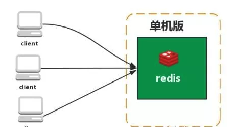
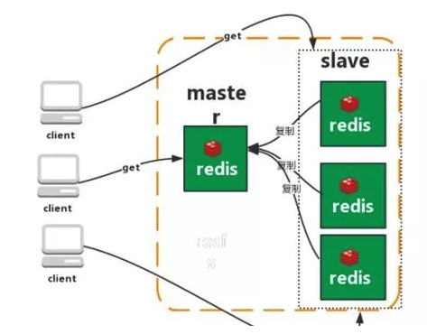
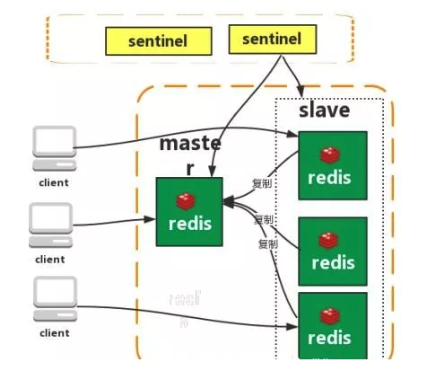
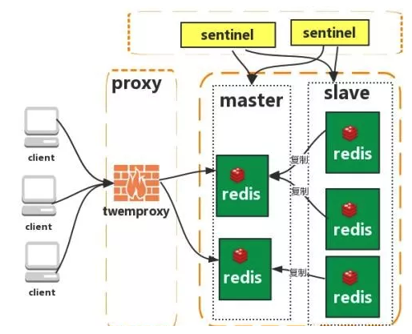
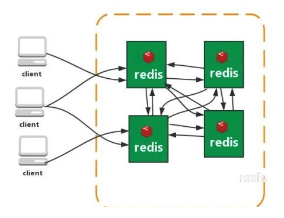

# redis数据库

<!-- vim-markdown-toc Marked -->

* [1.概述](#1.概述)
        - [1.1教程](#1.1教程)
        - [1.2基本介绍](#1.2基本介绍)
* [2.五大数据类型](#2.五大数据类型)
        - [2.1字符串(string)](#2.1字符串(string))
        - [2.2哈希(Hash)](#2.2哈希(hash))
        - [2.3列表(List)](#2.3列表(list))
        - [2.4集合(Set)](#2.4集合(set))
        - [2.5有序集合(Sorted List)](#2.5有序集合(sorted-list))
        - [2.6位图(redis bitmap)](#2.6位图(redis-bitmap))
* [3.使用场景](#3.使用场景)
        - [3.1计数器](#3.1计数器)
        - [3.2缓存](#3.2缓存)
        - [3.3查找表](#3.3查找表)
        - [3.4消息队列](#3.4消息队列)
        - [3.5会话缓存](#3.5会话缓存)
        - [3.6分布式锁](#3.6分布式锁)
        - [3.7其他](#3.7其他)
* [4.事务](#4.事务)
        - [4.1事务基础](#4.1事务基础)
* [5.持久化](#5.持久化)
        - [5.1RDB(redis database)方式](#5.1rdb(redis-database)方式)
        - [5.2AOF(append-only)方式](#5.2aof(append-only)方式)
        - [5.3虚拟内存方式](#5.3虚拟内存方式)
        - [5.4持久化方式对比](#5.4持久化方式对比)
* [6.数据回收](#6.数据回收)
        - [6.1数据淘汰(回收)策略](#6.1数据淘汰(回收)策略)
        - [6.2回收进程工作](#6.2回收进程工作)
* [7.redis架构模式](#7.redis架构模式)
        - [7.1单机模式](#7.1单机模式)
        - [7.2主从复制](#7.2主从复制)
        - [7.3哨兵模式](#7.3哨兵模式)
        - [7.4集群(proxy型)](#7.4集群(proxy型))
        - [7.5集群(直连型)](#7.5集群(直连型))
* [8.分布式](#8.分布式)
        - [8.1一致性hash](#8.1一致性hash)
        - [8.2hash槽](#8.2hash槽)
* [9.常用配置](#9.常用配置)
* [a.其他](#a.其他)
        - [a.5面试](#a.5面试)
        - [a.6内存优化](#a.6内存优化)

<!-- vim-markdown-toc -->

## 1.概述

### 1.1教程

- [github中redis知识点](https://github.com/CyC2018/CS-Notes/blob/master/notes/Redis.md)
- [redis中文网以及教程](https://www.redis.net.cn)
- [redis中文教程](https://www.redis.com.cn/tutorial.html)

### 1.2基本介绍

- 全称：`Remote Dictionary Server`
- `纯内存的key-value数据库`，整个数据库加载到内存中，性能极高，通过`异步定期将数据持久化到硬盘`
- 支持多种数据类型，且最大的value值为GB级别，因此可以实现多种功能(如：list实现消息队列，set实现标签系统)
- `数据库容量受物理内存限制`，适合较小数量的高性能操作和运算
- 单机的支持并发量可能支持10几万
- redis的命令`不区分大小写`
- 不支持为单一的数据库设置密码，要么访问所有的全部数据库，要么不能访问
- redis的数据库db更像一种命令空间，不适合一个实例存储不同应用的数据，不同的应用应该使用不同的redis实例(单个redis实例只占用内存约1m)来存储数据
- 集群情况下不支持使用select来切换db,只有一个db0

## 2.五大数据类型

### 2.1字符串(string)

- 最基本的数据类型
- 二级制安全，即string可以包含任何数据，如jpg图片或者序列化的对象
- `一个键最多存储512MB`
- 使用场景：`缓存，计数，共享session，限速`

### 2.2哈希(Hash)

- 一个键值对集合
- 适合存储对象
- 每个hash可以存储$2^{32 - 1}$（40多亿）键值对
- 使用场景：`键值对存储，缓存等`

### 2.3列表(List)

- 简单的字符串列表
- 每个列表最多可以存储$2^{32-1}$键值对
- 使用场景：`消息队列，栈，文章列表`

### 2.4集合(Set)

- string的无序集合
- 通过哈希表实现
- 每个集合最多可以存储$2^{32-1}$成员
- 使用场景：`用户加标签，抽奖功能`

### 2.5有序集合(Sorted List)

- 类似集合，不同的是每个元素都会关联一个double类型的分数，通过该分数对成员进行从小到大的排列
- 成员唯一，但是分数却可以重复
- 使用场景：`排行榜，延迟消息队列`

### 2.6位图(redis bitmap)

- 通过类似map的结构存放0或者1(bit位)作为值
- 使用场景：`统计状态，日活，是否浏览过某个东西`

## 3.使用场景

### 3.1计数器

- 对String进行自增或者自减实现计数

### 3.2缓存

- 将热点数据放到内存中,设置内存的最大使用量以及淘汰策略来保证缓存的命中率
- 

### 3.3查找表

- DNS记录适宜使用redis存储

### 3.4消息队列

- List是双向链表，可以通过lpush和rpop写入和读取消息
- 最好还是使用RabbitMQ等消息中间件比较好

### 3.5会话缓存

- [Django获取用户浏览历史，使用redis缓存](https://www.cnblogs.com/mxsf/p/10297271.html)
- [使用redis存储用户浏览记录](https://blog.csdn.net/weixin_44313745/article/details/95754500)
- 存储多台服务器的会话

### 3.6分布式锁

**分布式锁介绍：**

在分布式的环境下，保证一个方法或属性在高并发的情况之下同一时间只能被同一个线程使用。用来解决跨机器的互斥机制来控制共享资源的访问。

1. 分布式系统环境下，一个方法在同一时间只能被一个机器的一个线程使用
2. 高可用的获取锁和释放锁
3. 高性能的获取锁和释放锁
4. 具备可重入特性
5. 具备锁失效机制，防止死锁
6. 具备非阻塞特性，即没有获取到锁将直接返回获取锁失败

**使用redis实现分布式锁：**

- 可以使用Redis的`SETNX`命令实现分布式锁
- 也可以使用官方的RedLock分布式锁实现
- [python-redis分布式锁的简单实现](../../python/modules/redis/redis_lock/redis_lock.py)

### 3.7其他

- Set可以实现交集，并集等操作，实现共同好友功能
- ZSet可以实现有序性操作，实现排行榜功能

## 4.事务

### 4.1事务基础

- 一次执行`多个命令`
- `事务是一个单独的隔离操作`：事务中的所有命令都会序列化，按顺序的执行,事务执行的过程中不会被其他命令打断
- 事务是`原子操作`，要么全部执行，要么全部不执行

## 5.持久化

- 即`数据备份和恢复`
- [redis持久化之RDB和AOF](https://www.cnblogs.com/itdragon/p/7906481.html)

### 5.1RDB(redis database)方式

1. 缺省情况下redis将`数据快照存放在磁盘的二进制文件上中（dump.rdb）`
2. 可以配置其持久化策略定期或者超过M次更新时将数据写入磁盘，或者`手动调用SAVE或者BGSAVE`
3. 适合大规模数据恢复，`对数据的完整性和一致性要求不高的场景`，当系统停止或者redis被杀死数据就会丢失

### 5.2AOF(append-only)方式

1. 采用日志的方式`记录每一个写操作，并追加到文件`
2. redis重启会根据日志文件的内容将`写指令从前至后执行一次`以完成数据的恢复工作
3. `数据的完整性和一致性更高`，但是记录的内容多，文件越来越大，数据恢复也会越来越慢

### 5.3虚拟内存方式

1. 当key很小而value很大时，使用效果会很好

### 5.4持久化方式对比

- aof文件更新频率较adb高，优先使用aof还原文件
- aof的安全性优于adb
- rdb的性能优于aof
- 优先使用aof

## 6.数据回收

### 6.1数据淘汰(回收)策略

- [redis数据淘汰策略](https://www.cnblogs.com/mysql-hang/articles/10532720.html)
- [redis数据淘汰策略及其相关注意事项](https://blog.csdn.net/qq_22860341/article/details/80681373)
- 比如保证`数据都是热点数据`

1. allkeys-lru, 尝试回收使用最少的键
2. allkeys-random, 回收随机的键
3. volatile-lru,尝试回收使用最少的键，但仅限于已经过期的
4. volatile-random, 回收随机的键，仅限于已经过期的
5. volatile-ttl, 回收过期的键，优先回收存活时间短的键
6. no-enviction, 驱逐，禁止驱逐数据

### 6.2回收进程工作

- 内存使用达到`maxmemory`后，使用设置的策略回收
- 删除过期时间的键对象(惰性删除-用户访问的时候删除，定时任务删除)

## 7.redis架构模式

### 7.1单机模式

- 简单
- 内存有限，处理能力有限，无法做到高可用(高可用即一旦系统中断可以很快恢复)

结构如下：

### 7.2主从复制

- 利用`复制`功能，用一个redis服务器创建多个其复制品，主服务器(master)将数据更新同步到从服务器(slave)，保证数据相同
- 降低master的度压力，但是没有降低写压力，仍然做不到高可用

结构如下：

### 7.3哨兵模式

- 分布式系统监控redis主从服务器，主服务器下线时候自动故障转移
- `监控`：哨兵(sentinel)不断的检查主从服务器是否运行正常
- `提醒`：当有服务器发生故障的时候，通过api发送通知给管理员或其他应用程序
- `自动故障迁移`：当主服务器不能正常工作时候，会进行一次故障迁移工作
- 特点：保证高可用，监控各个节点，自动故障迁移；主从模式，切换需要你时间；但仍然没有解决master的写压力

结构如下：

### 7.4集群(proxy型)

- [redis模式集群原理与搭建](https://www.jianshu.com/p/84dbb25cc8dc)
- [redis集群详细搭建过程](https://blog.csdn.net/qq_42815754/article/details/82912130)

Twemproxy 是一个 Twitter 开源的一个 redis 和 memcache 快速/轻量级代理服务器； Twemproxy 是一个快速的单线程代理程序，支持 Memcached ASCII 协议和 redis 协议。

特点：

- 多种 hash 算法：MD5、CRC16、CRC32、CRC32a、hsieh、murmur、Jenkins
- 支持失败节点自动删除
- 后端 Sharding 分片逻辑对业务透明，业务方的读写方式和操作单个 Redis 一致

缺点：

- 增加了新的 proxy，需要维护其高可用
- failover 逻辑需要自己实现，其本身不能支持故障的自动转移可扩展性差，进行扩缩容都需要手动干预

结构如下：

### 7.5集群(直连型)

特点：

- 无中心架构（不存在哪个节点影响性能瓶颈），少了 proxy 层
- 数据按照 slot 存储分布在多个节点，节点间数据共享，可动态调整数据分布
- 可扩展性，可线性扩展到 1000 个节点，节点可动态添加或删除
- 高可用性，部分节点不可用时，集群仍可用。通过增加 Slave 做备份数据副本
- 实现故障自动 failover，节点之间通过 gossip 协议交换状态信息，用投票机制完成 Slave到 Master 的角色提升

缺点：

- 资源隔离性较差，容易出现相互影响的情况
- 数据通过异步复制,不保证数据的强一致性

结构如下：

## 8.分布式

### 8.1一致性hash

- [一致性hash介绍](https://www.cnblogs.com/lpfuture/p/5796398.html)
- 目的：为了解决`网络热点问题，即单个节点热度大，负载大`
- 基本思路：一致性哈希将整个哈希值空间组织成一个虚拟的圆环，将各个服务器使用Hash进行一个哈希，将数据key使用相同的函数Hash计算出哈希值，并确定此数据在环上的位置，从此位置沿环顺时针“行走”，第一台遇到的服务器就是其应该定位到的服务器

### 8.2hash槽

- [redis一致性hash与hash槽](https://www.jianshu.com/p/6ad87a1f070e)
- 组成为：`hash算法+槽位`)，使用的hash算法是`crc16校验算法`，槽位的概念则是对于空间分配的规则。
- redis哈希槽包含16384个槽位
- 每个key计算后落到一个槽位
- 槽位由用户分配，内存大的可以分配多个槽位

## 9.常用配置

- `redis.conf`配置

```sh
daemonize yes  # 配置为守护进程(在后台运行并且不受任何终端控制的进程)的方式运行
databases 16  # 设置数据库的数量，默认使用的为数据库0

port 6379  # 指定监听端口
bind  # 绑定的主机地址

timeout 300  # 客户端闲置多久时间关闭连接
loglevel verbose  # 指定日志级别，一共支持四个级别，debug, verbose(默认), notice, warning

logfile stdout  # 日志记录方式，默认为标准输出

slaveof <masterip> <masterport>  # 当设置本机为slave服务时，设置master服务的ip地址和端口
masterauth <master-password>  # master服务设置密码保护的时候连接master的密码

requirepass 123456  # 设置连接密码，客户端连接redis的时候需要通过 auth <password> 提供密码
maxclients 128  # 设置同一时间能够连接的最大客户端连接数，默认无限制，达到最大连接数的时候返回 max number

maxmemory <bytes>  # 设置最大内存闲置，达到最大内存的时候会尝试清除已到期或者即将到期的key

include /path/to/local.conf  # 指定包含其他的配置文件，可以在同一主机上多个 Redis 实例之间使用同一份配置文件，而同时各个实例又拥有自己的特定配置文件
```

## a.其他

### a.5面试

- [redis面试三十问](http://blog.itpub.net/31545684/viewspace-2213990/)
- [漫画:redis面试常见问题1](https://mp.weixin.qq.com/s?__biz=MzI4Njc5NjM1NQ==&mid=2247486641&idx=2&sn=16594b5394e52a5b0884156c271e58cf&chksm=ebd6339ddca1ba8b85df41d508434c2e727ed31736cc353d376e200e62932180f978d7f763a9&scene=21#wechat_redirect)
- [漫画:redis面试常见问题1](https://mp.weixin.qq.com/s?__biz=MzI4Njc5NjM1NQ==&mid=2247486734&idx=2&sn=7ebb4e8d86ddae67522244c8e8584ef0&chksm=ebd63222dca1bb34515cfadd321e3d82bcbeb6210812af087ae254181067cc45cb5f740602b4&scene=21#wechat_redirect)

### a.6内存优化

- 尽量使用散列表(hashes),将数据模型抽象到一个散列表格中，如将人的姓名，邮箱，年龄等存储到一张表。
