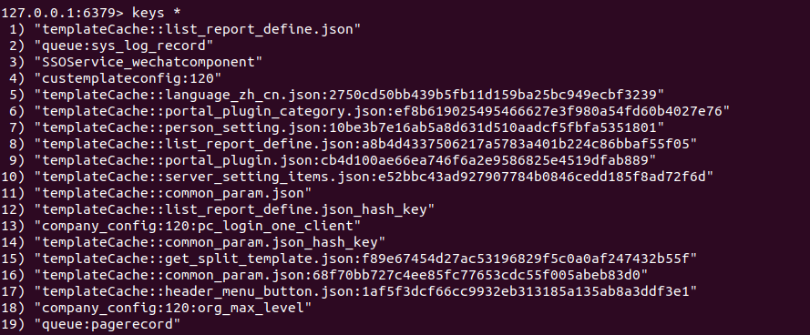

# redis数据库

<!-- TOC -->autoauto- [redis数据库](#redis数据库)auto    - [1.概述](#1概述)auto        - [1.1安装使用](#11安装使用)auto        - [1.2数据库操作常用命令](#12数据库操作常用命令)auto    - [2.五大数据类型](#2五大数据类型)auto        - [2.1字符串(string)](#21字符串string)auto        - [2.2哈希(Hash)](#22哈希hash)auto        - [2.3列表(List)](#23列表list)auto        - [2.4集合(Set)](#24集合set)auto        - [2.5有序集合(Sorted List)](#25有序集合sorted-list)auto    - [3.使用场景](#3使用场景)auto        - [3.1计数器](#31计数器)auto        - [3.2缓存](#32缓存)auto        - [3.3查找表](#33查找表)auto        - [3.4消息队列](#34消息队列)auto        - [3.5会话缓存](#35会话缓存)auto        - [3.6分布式锁](#36分布式锁)auto        - [3.7其他](#37其他)auto    - [4.事务](#4事务)auto        - [4.1事务基础](#41事务基础)auto        - [4.2redis事务机制命令](#42redis事务机制命令)auto    - [5.持久化](#5持久化)auto        - [5.1RDB](#51rdb)auto        - [5.2AOF](#52aof)auto        - [5.3虚拟内存方式](#53虚拟内存方式)auto    - [a.其他](#a其他)auto        - [a.1客户端连接](#a1客户端连接)auto        - [a.2安全](#a2安全)auto        - [a.3性能测试](#a3性能测试)auto        - [a.4发布-订阅](#a4发布-订阅)autoauto<!-- /TOC -->

- [github中redis知识点](https://github.com/CyC2018/CS-Notes/blob/master/notes/Redis.md)
- [redis中文网以及教程](https://www.redis.net.cn/tutorial/3501.html)

## 1.概述

### 1.1安装使用

**安装：**

```shell
# 安装
sudo apt-get install redis-server
```

**配置：**

```shell
# 可以配置redis的绑定ip为0.0.0.0
vim /etc/redis/redis.conf
```

**启动进入：**

```shell
# 启动redis
sudo service redis-server restart

# 进入redis服务端
redis-server
# 进入redis客户端，输入ping来判断是否可以连接
redis-cli

# 在远程的服务器上执行
redis-cli -h host -p port -a password
```

### 1.2数据库操作常用命令

- [redis命令参考](http://redisdoc.com/)

**数据库的操作:**

```shell
# 切换到不同的数据库，默认为0，共16个
select 1

# 查看当前数据库的key的数量
dbsize

# 清空当前数据库的所有key
flushdb

# 清空整个redis服务器的数据(所有数据库的所有key)
flushall

# 对换0,1两个数据库
swapdb 0 1

# 查看redis服务器的信息,进入redis-cli之后
info
```

**key的操作:**

```shell
# 查看所有的key
keys *

# 删除键
del key

# 序列化给定key，并返回序列化的值
dump key

# 将序列化的值反序列化,0为ttl的时间
restore key 0 "\x00\x15hello, dumping world!\x06\x00E\xa0Z\x82\xd8r\xc1\xde"

# 判断给定的key是否存在
exists key

# 给key设置过期时间为10秒
expire key 10

# 查看key的剩余生存时间(s)
ttl key

# 将一个带有过期的key设置为永久的不过期的key
persist key

# 将key移动到新的数据库1
move key 1

# 查看key所存储的值的类型
type key

# 修改key的名称
rename key newkey
```

**调试：**

```shell
# 客户端向服务器发送查看服务器是否正常
ping
```

## 2.五大数据类型

redis的命令不区分大小写。

### 2.1字符串(string)

- 最基本的数据类型
- 二级制安全，即string可以包含任何数据，如jpg图片或者序列化的对象
- `一个键最多存储512MB`

```shell
# 设置键值
set name "tony"

# 取值
get name
```

### 2.2哈希(Hash)

- 一个键值对集合
- 适合存储对象
- 每个hash可以存储$2^{32 - 1}$（40多亿）键值对

```shell
# 设置hash键值对
hmset user:1 name tony pwd 123456

# 取得hash键值对
hgetall user:1
```

### 2.3列表(List)

- 简单的字符串列表
- 每个列表最多可以存储$2^{32-1}$键值对

```shell
# 添加一个元素到列表的头部
lpush names tony
lpush names tom

# 获取列表的内容
lrange names 0 10
```

### 2.4集合(Set)

- string的无序集合
- 通过哈希表实现
- 每个集合最多可以存储$2^{32-1}$成员

```shell
# 添加一个string元素到key对应的set集合中，成功返回1
# 再次添加相同的元素会因为唯一性被忽略,返回0
sadd names tony

# 获取集合中的元素
smembers names
```

### 2.5有序集合(Sorted List)

- 类似集合，不同的是每个元素都会关联一个double类型的分数，通过该分数对成员进行从小到大的排列
- 成员唯一，但是分数却可以重复

```shell
# 添加元素到有序集合
zadd names 0 tony
zadd names 10 jim

# 取有序集合中的元素
zrangebyscore names 0 100
```

## 3.使用场景

### 3.1计数器

- 对String进行自增或者自减实现计数

### 3.2缓存

- 将热点数据放到内存中,设置内存的最大使用量以及淘汰策略来保证缓存的命中率
- 

### 3.3查找表

- DNS记录适宜使用redis存储

### 3.4消息队列

- List是双向链表，可以通过lpush和rpop写入和读取消息
- 最好还是使用RabbitMQ等消息中间件比较好

### 3.5会话缓存

- 存储多台服务器的会话

### 3.6分布式锁

**分布式锁介绍：**

在分布式的环境下，保证一个方法或属性在高并发的情况之下同一时间只能被同一个线程使用。用来解决跨机器的互斥机制来控制共享资源的访问。

1. 分布式系统环境下，一个方法在同一时间只能被一个机器的一个线程使用
2. 高可用的获取锁和释放锁
3. 高性能的获取锁和释放锁
4. 具备可重入特性
5. 具备锁失效机制，防止死锁
6. 具备非阻塞特性，即没有获取到锁将直接返回获取锁失败

**使用redis实现分布式锁：**

- 可以使用Redis的`SETNX`命令实现分布式锁
- 也可以使用官方的RedLock分布式锁实现
- [python-redis分布式锁的简单实现](../../python/modules/redis/redis_lock/redis_lock.py)

### 3.7其他

- Set可以实现交集，并集等操作，实现共同好友功能
- ZSet可以实现有序性操作，实现排行榜功能

## 4.事务

### 4.1事务基础

- 一次执行`多个命令`
- `事务是一个单独的隔离操作`：事务中的所有命令都会序列化，按顺序的执行,事务执行的过程中不会被其他命令打断
- 事务是`原子操作`，要么全部执行，要么全部不执行

### 4.2redis事务机制命令

- `MULTI`
- `EXEC`
- `DISCARD`
- `WATCH`

```shell
# 开始事务。
# 命令入队。
# 执行事务。

# 一下为一个事务的全过程

multi
set name tony
get name tony
exec
```

## 5.持久化

即`数据备份和恢复`

- [redis持久化之RDB和AOF](https://www.cnblogs.com/itdragon/p/7906481.html)

### 5.1RDB

1. 缺省情况下redis将数据快照存放在磁盘的二进制文件上中（dump.rdb）
2. 可以配置其持久化策略定期或者超过M次更新时将数据写入磁盘，或者`手动调用SAVE或者BGSAVE`
3. 适合大规模数据恢复，`对数据的完整性和一致性要求不高的场景`，当系统停止或者redis被杀死数据就会丢失

### 5.2AOF

1. 采用日志的方式记录每一个写操作，并追加到文件
2. redis重启会根据日志文件的内容将`写指令从前至后执行一次`以完成数据的恢复工作
3. `数据的完整性和一致性更高`，但是记录的内容多，文件越来越大，数据恢复也会越来越慢

### 5.3虚拟内存方式

1. 当key很小而value很大时，使用效果会很好

```shell
# 创建当前数据库的备份，会在安装的目录创建dump.rdb文件
# 在生产环境很少执行 SAVE 操作，因为它会阻塞所有客户端，保存数据库的任务通常由 BGSAVE 命令异步地执行
save

# 恢复数据，只需要将备份文件`dump.rdb`移动到redis的安装目录

# 查看备份文件的位置
config get dir

# 在后台异步的保存数据库
bgsave

# 返回最近一次Redis成功将数据保存到磁盘的时间，Unix时间戳形式
lastsave
```

## a.其他

### a.1客户端连接

```shell
# 获取最大连接数量
config get maxclients

# 服务端启动时候设置最大连接数
redis-server --maxclients 10000
```

### a.2安全

设置密码，客户端连接的时候就需要验证。

```shell
# 查看是否设置了密码
config get requirepass

# 设置密码
config set requirepass "123456"

# 获取密码
config get requirepass

# 验证密码
auth 123456
```

### a.3性能测试

```shell
# 模拟同时执行1000个请求来检测性能
redis-benchmark -n 1000
```

### a.4发布-订阅

发布-订阅(pub/sub)是一种消息通信模式。

```shell
# 在客户端1订阅channel1频道的消息
subscribe channel1

# 订阅多个符合条件的频道
psubscribe news.*channel

# 退订频道
unsubscribe

# 在客户端2发送消息到channel1,返回结果会显示订阅该频道的数量
publish channel1 hello

# 查看当前的活跃频道(即至少有一个订阅者的频道)
pubsub channels
```
