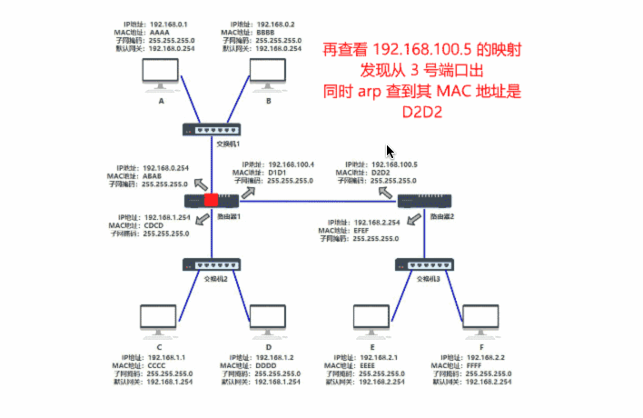

# 计算机网络介绍

<!-- vim-markdown-toc Marked -->

* [1.概述](#1.概述)
* [2.物理层](#2.物理层)
* [3.数据链路层](#3.数据链路层)
* [4.网络层](#4.网络层)
* [5.运输层](#5.运输层)
* [6.应用层](#6.应用层)
* [x.其他](#x.其他)
    - [x.1socket介绍](#x.1socket介绍)

<!-- vim-markdown-toc -->

## 1.概述

- [计算机网络第七版 谢希仁]

## 2.物理层

- 物理层上所传送的数据单位是比特
- 常用协议：`中继器`，`集线器`，HUB，网线
- `集线器`：将电信号转发到所有出口(广播)

## 3.数据链路层

- 简称`链路层`
- 两台主机之间的数据传输，总是在一段一段的链路上传送的，这就需要使用专门的链路层的协议
- 两个相邻节点之间传送数据时，数据链路层将网络层交下来的IP数据报组装成`帧`，在两个相邻节点间的链路上传送帧。每一帧包括数据和必要的控制信息（如：同步信息，地址信息，差错控制等)
- 常用协议：arq(自动重传请求协议), ppp(点对点协议), csma/cd(停止等待协议)
- `交换机`：根据数据包，只将数据发给目标Mac地址指向的那台电脑，维护一张mac地址表，保存所有连接的设备

## 4.网络层

- 选择合适的网间路由和交换结点， 确保网络中的计算机的数据及时传送
- 把运输层产生的报文段或用户数据报封装成`分组`和`包`进行传送,由于使用IP协议，因此分组也叫IP数据报，简称`数据报`
- 常用协议：`IP(网际协议)`, `arp(地址转换协议)`, rarp(反向地址转换协议), icmp(internet控制报文协议), igmp(internet组管理协议), rip(路由信息协议), ospf(分布式链路状态协议), bgp(边界网关协议)
- `路由器`：

路由器如何将数据转发到指定设备：

1. 组网的设备上有mac地址和ip地址，机器之间的数据传输加上mac地址和ip地址
2. 确定使用路由器的时机：源ip和目标ip处于不同的子网
3. 确定两台机器是否处于一个子网：将`子网掩码`和源ip，子网掩码和目标ip分别进行`与运算`。结果相同则处于同一个子网，eg：`192.168.0.1 & 255.255.255.0 = 192.168.0.0;  192.168.0.1 & 255.255.255.0 = 192.168.0.0`，两者处于同一个子网
4. 处于不同子网的机器，A直接将数据发送给默认网关(路由器)，这个默认网关的地址需要配置
5. 路由器通过`路由表`将数据转发到`下一跳`
6. 路由表不是一对一的关系，将ip和子网掩码一起表示为`192.168.0.1/24`，24就是前24位表示子网的网段，路由表通过路由算法获得
7. 发送数据不知道目的机器的mac地址：使用`arp`协议，每个电脑里维护一张`arp缓存表`，表中记录ip和mac地址的对应关系，一开始是空的，A知道B的ip地址，为了知道B的mac地址，广播一条arp请求，B收到之后带上自己的mac地址响应，A收到后更新自己的arp缓存表

数据传输示例: 

## 5.运输层

- 负责向两台主机进程之间的通信提供通用的数据传输服务
- 运输层有`复用`和`分用`的功能,复用就是指多个应用层进程可同时使用下面运输层的服务，分用相反，是运输层把收到的信息分别交付上面应用层中的相应进程
- 常用协议：tcp(传输控制协议), udp(用户数据报文协议)

## 6.应用层

- 通过应用进程间的交互完成特定网络应用
- 应用层协议：定义进程间交互和通信的规则，如DNS, HTTP, SMTP等
- 应用层交互的数据单元称为`报文`
- 常用协议：http, ftp(文件传输协议), smtp(简单邮件传输协议), ssh(安全外壳协议), dns(域名系统), dhcp(动态主机配置协议), telnet(远程登陆协议)

## x.其他

### x.1socket介绍

- 即网络套接字，应用程序与网络协议根进行交互的接口
