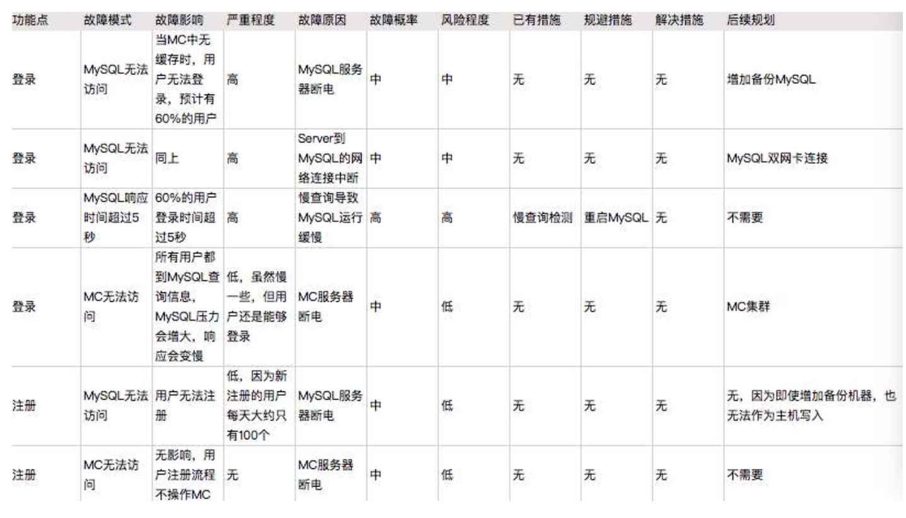

# 架构

<!-- vim-markdown-toc Marked -->

* [1.概述](#1.概述)
* [2.架构设计的目的](#2.架构设计的目的)
* [3.架构设计的复杂度来源](#3.架构设计的复杂度来源)
    - [3.1高性能](#3.1高性能)
    - [3.2高可用](#3.2高可用)
        + [3.2.1高可用计算](#3.2.1高可用计算)
        + [3.2.2高可用存储](#3.2.2高可用存储)
        + [3.2.3高可用状态决策](#3.2.3高可用状态决策)
    - [3.3高可扩展性](#3.3高可扩展性)
    - [3.4低成本，安全，规模](#3.4低成本，安全，规模)
* [4.架构设计的三原则](#4.架构设计的三原则)
* [5.架构设计流程](#5.架构设计流程)
    - [5.1识别复杂度](#5.1识别复杂度)
    - [5.2设计备选方案](#5.2设计备选方案)
    - [5.3评估和选择备选方案](#5.3评估和选择备选方案)
    - [5.4详细方案设计](#5.4详细方案设计)
* [6.高性能数据库集群](#6.高性能数据库集群)
    - [6.1读写分离](#6.1读写分离)
    - [6.2分库分表](#6.2分库分表)
* [7.高性能NoSQL](#7.高性能nosql)
    - [7.1常见的NoSQL方案](#7.1常见的nosql方案)
    - [7.2高性能缓存架构](#7.2高性能缓存架构)
* [8.单服务器高性能模式](#8.单服务器高性能模式)
    - [8.1TPC与PPC架构模式](#8.1tpc与ppc架构模式)
    - [8.2Reactor和Proactor架构模式](#8.2reactor和proactor架构模式)
* [9.高性能负载均衡](#9.高性能负载均衡)
    - [9.1负载均衡分类及架构](#9.1负载均衡分类及架构)
    - [9.2负载均衡算法](#9.2负载均衡算法)
* [10.CAP理论](#10.cap理论)
* [11.高可用存储架构](#11.高可用存储架构)
    - [11.1双机架构](#11.1双机架构)
    - [11.2集群和分区](#11.2集群和分区)
* [x.其他](#x.其他)
* [x.1架构图](#x.1架构图)
    - [x.2数据库性能优化思路步骤](#x.2数据库性能优化思路步骤)
    - [x.3常见系统与数据库选型](#x.3常见系统与数据库选型)
* [x.2FEMA方法](#x.2fema方法)

<!-- vim-markdown-toc -->

## 1.概述

- `系统`，相互协同可运行的实体
- `子系统`，有关联的个体组成，但是多半是更大系统的一部分
- `软件模块`, 系统从业务纬度的指责的划分，包含`程序`和`数据结构`,从`逻辑角度来拆分系统得到`,如登录模块
- `组件`，系统从技术纬度上的复用，从`物理的角度拆分得到`，如mysql, nginx等
- `框架`，为了实现业界标准或完成特定基本任务的软件组成`规范`,也指符合该规范的软件产品
- `架构`，指软件系统的`顶层结构`, 创造这些基础结构的准则以及对这些结构的描述,可以有不同的角度来区分
   - 业务逻辑角度
   - 物理部署角度
   - 开发规范角度

系统是一群关联的个体组成，个体可以是子系统，模块，组件等，架构需要明确系统包含哪些个体。

## 2.架构设计的目的

- 架构是为了应对软件系统复杂度而提出的解决方案，因此其设计目的是`为了解决软件系统复杂度带来的问题`
- 需要理解系统复杂性所在的位置
- 不必面面俱到，需要识别出复杂点针对性的解决问题
- 对别其他架构以及业务复杂点，参考复杂点相似的方案

## 3.架构设计的复杂度来源

### 3.1高性能

- `衡量性能的要素`：响应时间,tps(transaction per second)每秒事务数，服务器资源利用率等
- `高性能的目的`：追求良好的用户体验，满足业务增长的需要
- 高性能需要和业务所处的阶段相匹配，一味的追求高性能没有实际意义

如何做好高性能?

1. 垂直纬度增加单机性能
    - 增大内存，减少i/o操作
    - 使用ssd或者raid
    - 置换服务器使用获得更多的服务器或者核
    - 升级网络接口或者网络接口
2. 水平纬度
    - 功能分割，同一组件重复部署到多台不同服务器
    - 多实例副本，
    - 数据分割，每台机器上只部署一部分数据

### 3.2高可用

#### 3.2.1高可用计算

- 任务分配，双机算法：主备(冷备，热备，温备)，主主
- 高可用分类：计算高可用，存储高可用，

#### 3.2.2高可用存储

- 含义为可以`不中断的执行`其功能,各种高可用方案本质都是通过`冗余`实现
- 存储高可用领域的cap理论：存储高可用不能同时满足`一致性，可用性，分区容错性`,最多只能满足其中两个

#### 3.2.3高可用状态决策

- 高性能和高可用的基础，即系统需要判断当前的状态为正常还是异常
- 几种常见的决策方式：独裁式，协商式，民主

### 3.3高可扩展性

- 为了系统需求的变化，在未来的新需求的情况下，可以仅做少量的改动，就可支持
- 复杂点在于：不能每个设计点都考虑扩展性；不能完全不考虑扩展性
- 系统最后都要处理的问题：拆分出`变化层`和`稳定层`；需要抽象出变化层和稳定层的接口
- 良好的可扩展系统的特点：符合开闭原则(对扩展打开，对修改关闭)；对内部实现新功能的时候，对系统功能影响小；对外部，与其他系统松耦合

实际场景中的解决方案：

1. 使用分布式(服务)框架来解决，如`Dubbo`来解决
2. 使用分布式消息队列,如`rabbitmq`

### 3.4低成本，安全，规模

- 低成本：引入新技术，小公司适用；开创新的技术领域，大公司适用
- 安全：功能安全，架构安全

## 4.架构设计的三原则

- 目的：为了在比较多的选择中选取到比较适合当时业务场景的架构

1. `合适原则`，第一考虑，需要撇配当前的业务阶段
2. `简单原则`，第二考虑，如果简单的方案和复杂的方案都可以满足要求，优先使用简单方案
3. `演化原则`，第三考虑，快读落地，满足业务需要，然后在运行过程中不断演进

## 5.架构设计流程

### 5.1识别复杂度

1. 构建复杂度的来源清单，即架构的复杂度是什么引起的，如：高性能，可用性，扩展性，安全，低成本，规模等
2. 结合资源，技术，团队等对上述可能的复杂度原因逐一分析
3. 根据复杂度的优先级，越关键，优先解决

**常见系统的性能量级:**

- nginx负载均衡的性能量级在3万
- http的请求访问在2万
- zookeeper写入读取2万

### 5.2设计备选方案

- 数量上在3-5个
- 备选方案之间尽量要有明显的差异
- 备选方案不要局限于已经熟悉的技术
- 备选方案关注技术选型，不要过分关注技术细节

### 5.3评估和选择备选方案

- 列出需要关注的质量需求属性点，然后分别从这些质量属性的纬度去评估每个方案，从中挑选出合适的.
- 需求属性点包括：性能，可用性，硬件成本，项目投入，复杂性，安全性，可扩展性
- 评估这些质量属性的时候，也要根据架构设计原则，`简单原则`和`合适原则`

### 5.4详细方案设计

- 将方案设计的关键技术细节敲定

## 6.高性能数据库集群

### 6.1读写分离

- 将`访问压力`分散到集群中的多个节点，但是没有分散`存储压力`, 适合`读多写少`的问题
- 数据库服务器搭建主从集群，`一主多从`
- 主机通过复制将数据同步到从机，`每台数据库服务器存储所有的业务数据`
- 业务服务器将写操作发给数据库主机，读操作发给数据库从机
- 业务服务器-->数据库中间件-->数据库集群

两个设计复杂度：

1. `主从复制延迟`，即数据更新量大时，从机来不及复制主机的数据，导致业务问题，解决方法有：
    - 写操作后的读操作指定发给数据库主服务器
    - 读从机失败后再读一次主机, 即`二次读取`
    - 关键业务读写指向主机，非关键业务数据读写分离, 相对可取
2. `分配机制`，即如何根据读写来访问不同的数据库服务器，一般的两种方式:
    - `程序代码封装`，代码中抽象一个数据访问层，实现读写操作分离和数据库服务器连接的管理，也叫`中间层封装`，实现较简单，且可以根据业务做较多定制，但是不同语言不能通用，开源方案中较为出名的有`TDDL`
    - `中间件封装`，独立一套系统实现读写操作分离和数据库服务器连接的管理, 业务服务器直接访问中间件, 可以支持多种语言，对中间件的性能要求很高,较为出名的是`MySQL Proxy`

### 6.2分库分表

- 既可以分散访问压力，又可以分散存储压力
- `业务分库`，按照业务模块将数据分散到不同的数据库服务器
    - 导致无法使用join操作
    - 事务问题，无法通过事务统一修改
    - 成本问题
- `单表数据拆分`, 当一张表的数据过多时
    - `垂直分表`, 适合将不常用且占了大量空间的列拆分出去，如`description`等，导致的复杂性就是表操作的数量要增加, 适合对数据的操作主要集中在某些字段的业务
    - `水平分表`, 一般当表行数超过`5000万`行时使用，引入的复杂度包括：1.`路由`，需要路由算法查找数据到底属于哪个子表, 可使用有`范围路由`，`Hash路由`和`配置路由`, 适合对数据的操作在整个表面均匀分布的业务

## 7.高性能NoSQL

### 7.1常见的NoSQL方案

1. K-V存储，解决关系型数据库无法`存储数据结构`的问题，如`Redis`
    - 不支持完整的ACID事务，Redis的事务只能保证隔离性和一致性(IC)，不能保证原子性和持久性
2. 文档数据库，解决关系型数据库的`shema`约束的问题，如`MongoDB`
    - no-shema, 可以存储和读取任意的数据
    - 新增字段简单，历史数据不会出错，适合电商和游戏类场景，便于扩展新的属性
    - 最大的缺点就是不支持事务
3. 列式数据库，解决关系型数据库`大数据场景下的I/O`问题， 如`HBase`
    - 同时读取多个列时效率高
    - 能够一次性完成对一行中的多个列操作
4. 全文搜索引擎，解决关系型数据库的`全文搜索性能`问题，如`Elasticsearch`
    - 关系型数据库的全文模糊匹配用like，整表扫描，效率低
    - 技术原理为`倒排索引`，建立单词到文档的索引
    - 索引的对象为单词和文档

### 7.2高性能缓存架构

使用场景：

1. 需要经过复杂运算的场景，如统计网站当前在线户数量
2. 读多写少，存储系统无能为力
3. 接受一定是将内的数据不一致性

缓存设计要点：

- `缓存穿透`，缓存没有发挥作用，包括
    1. 存储数据不存在,解决方法是直接设置一个`默认值`
    2. 缓存数据生成耗费大量时间或者资源，典型的就是电商的分页
    3. 策略包括：双key,key的过期时间为t，key1无过期时间，每次缓存读取不到key就返回key1的内容，然后触发一个事件，该事件同时更新key和key1
- `缓存雪崩`，指缓存失效后引起的系统性能急剧下降的情况，解决方法有：
    1. `更新锁`，对缓存更新操作加锁保护，保证只有一个线程能够进行缓存更新，分布式系统还需要分布式锁
    2. `后台更新机制`，即由后台线程来更新缓存，而不是业务线程，相对更简单
- `缓存热点`，复制多分缓存副本，将请求分散到多个缓存服务器，注意不同的缓存服务器设置不同的失效时间

实现方式：程序代码实现的中间层或者独立的中间件.

缓存方案设计点：

1. 什么数据应该缓存
2. 什么时机触发缓存以及触发方式是什么
3. 缓存的层次和粒度
4. 缓存的命令规则和失效规则
5. 缓存的监控指标和故障应对方案
6. 可视化缓存如redis具体的key内容和大小

## 8.单服务器高性能模式

### 8.1TPC与PPC架构模式

高性能架构设计要点:

1. 提高单服务器的性能
2. 单服务器性能不能满足，设计集群方案

- 单服务器高性能的关键是设计并发模型，并发模型的两个设计关键点为：服务器如何管理连接；服务器如何管理请求
- 操作系统的I/O模型：阻塞，非阻塞，并发，非并发
- 操作系统的进程模型：单进程，多进程，多线程

两种单服务器高性能模式：

1. `PPC(Process Per Connection)`, 每次有新的连接就新建一个进程去处理这个请求, 父进程接受请求，fork子进程处理请求，代价较高，适合并发量低(最大几百)
    - 扩展为`prefork`模式，即提前创建进程，多个子进程接受同一个socket，但是有可能导致`惊群效应`
2. `TPC(Threading Per Connection)`, 每次有新的连接就新建一个线程去处理这个请求，容易导致`死锁问题`
    - 扩展为`prethread`模式，即预先创建线程

`高并发的划分`：

- 常量(几十上百，对应的硬件可能就是16核16G)连接，常量请求，如：内部运营系统，管理系统
- 常量连接，海量(成千上万)请求，如：中间件
- 海量连接，常量请求，如：门户网站
- 海量连接，海量请求，如：请购，双十一

三个指标：`响应时间`，`并发数`，`吞吐量(TPS)`,其中，吞吐量=并发数/平均响应时间

**这两种单服务器高性能模式(TPC与PPC)都主要适合常量连接的情况.**

### 8.2Reactor和Proactor架构模式

I/O多路复用技术:

- `技术来源`
    - 进程池来处理海量连接(socket)，进程不会处理完一个连接就销毁
    - 单个进程对应多个连接，如果进程阻塞在某个连接的read操作，也会影响性能，最好的方式是当连接有数据的时候进程才处理，即I/O多路复用
- `实现关键点`主要有两个
    1. 多个连接共用一个阻塞对象时，进程在一个阻塞对象上等待，不必轮询所有的连接，实现方式有: `select`,`epoll`,`kqueue`等
    2. 当某条连接有新的数据可以处理时，操作系统会通知进程，进程从阻塞态返回，处理业务

1. Reactor模式，即`I/O多路复用结合线程池`, Reacotr负责监听和分配事件，进程池负责处理事件
2. Proactor模式，是同步非阻塞模型

类似`比喻`：

- 同步阻塞；排队付钱拿了东西才离开
- Reactor模型：排队付钱，拿个号离开，准备好了通知来取
- Proactor模型：排队付钱，拿个号离开，准备好了东西直接送到你手中

## 9.高性能负载均衡

### 9.1负载均衡分类及架构

- 高性能集群的设计复杂度主要在`任务分配`, 使用`任务分配器(负载均衡器)`并通过适当的负载均衡算法达到高性能

负载均衡分类：

1. `DNS负载均衡`, 最常见，一般用于`地理级别的均衡`，同一个域名，北方用户解析到北方机房ip，南方解析到南方机房ip
    - 简单，成本低，无需自己开发或者维护负载均衡涉笔，就近访问
    - DNS缓存时间长导致更新不及时，可能会在ip改变后用户还是访问之前的ip，导致访问失败；扩展性差；分配策略也过于简单
2. `硬件负载均衡`, 是`集群级别的均衡`，使用特殊的硬件，如：`F5(百万级负载均衡)`和`A10`
    - 功能强，性能强大，稳定性和安全性较高
    - 价格昂贵, 扩展性差
3. `软件负载均衡`, 是`机器级别的均衡`，通过负载均衡软件，如: `Nginx(万级负载均衡)`和`LVS(十万级负载均衡)`
    - 简单，便宜，灵活，如nginx还可以使用插件扩展
    - 性能一般，不具备防火墙和防DDos

### 9.2负载均衡算法

常见分类有：

- 任务平均类，任务数或权重的平分
- 负载均衡类，根据系统的负载来分配，负载包括：cpu使用，连接数，I/O使用率，网卡吞吐量等
- 性能最优类，根据服务器的响应时间，优先分配给响应快
- Hash类别，根据某些关键值hash运算，相同hash值分配到同一台服务器

常见负载均衡算法：

1. `轮询`，将请求按顺序分配
    - 简单
2. `加权轮询`，根据服务器性能确定的一个静态配置的权重进行轮询
    - 较轮询好
    - 不能根据服务器的状态来更新
3. `负载最低优先`，将任务分配给负载最低的服务器
    - 解决轮询的缺点
    - 复杂度巨大
4. `性能最优类`，客户端角度出发
    - 复杂度大，也需要调优
5. `Hash类别`
    - 源地址hash，同一个源ip地址的任务分配给同一个服务器，适合存在会话，事务的业务
    - id hash，将某个id标示的业务分配到同一个服务器

## 10.CAP理论

- CAP定理，或布鲁尔定理，为分布式计算领域的一个定理，电商系统中需要做高可用架构
- 内容：`一个分布式系统(相互连接并共享数据的节点的集合)中，当涉及读写操作的时候，只能保证一致性(Consistence)、可用性(Availablity)、分区容错性(Partition Torlerance)三者中的两个，另外一个必须被牺牲`

**详细描述：**

- `一致性`：对于指定的客户端，读操作保证能够返回最新写操作的结果
- `可用性`：非故障的节点在合理的时间内返回合理的响应(不是错误和超时的响应)
- `分区一致性`：当出现网络分区(指由于某种原因，网络被分成若干个孤立的区域，而区域之间互不相通)之后，系统能够继续履行指责

**特点：**

- 由于网络不是百分百可靠，因此P要素必选，因此分布式系统架构只能为`AP`机构或者`CP`架构
- CAP关注的粒度是数据，不是系统，因此系统内的数据需要根据不同的场景和要求使用不同的架构，有的要AP，有的要CP
- CAP是忽略网络延迟的，但实际上事务提交复制到所有节点需要时间，因此C是不能完美实现
- 当P不存在的时候`(节点之间的网络连接一切正常时)，应该是尽量保证CA都实现，在分区期间(对于99.99%可用性的系统，分区不可用的时间只有50分钟)CA不能同时实现，可以通过在此期间记录一些日志，恢复之后根据日志进行数据恢复，从而达到CA状态`

## 11.高可用存储架构

- 常见的高可用存储架构有：`主备`，`主主`，`主从`，`集群`，`分区`
- 存储高可用的本质都是将数据备份到多个存储设备，通过数据冗余实现

### 11.1双机架构

1. `主备复制`，最常见，也最简单的一种方案
    - 主机负责读写，备机起备份作用，不做业务，也可手动将其改为主机，主机将数据复制到备用机
    - 硬件成本相对浪费，故障后需要人工干预修复，效率较低
    - 适合系统：`学生处理系统`，`员工管理系统`，`假期管理系统`等后台管理系统
2. `主从复制`
    - 主机负责读写，从机只负责读，主机将数据复制到从机
    - 主机故障，从机仍可以读
    - 客户端需要感知主从关系，将不同的操纵发给不同的机器，复杂度增高

### 11.2集群和分区

## x.其他

## x.1架构图

4 + 1视图介绍: https://blog.csdn.net/u014320421/article/details/90779353

- 逻辑视图，面向对象的设计方法时使用,是对系统职责的的逐级划分 
- 开发视图，逻辑架构元素，描述代码位置，可以是代码仓位置，或代码目录等系统的构建,这个构建信息需要包括构建依赖、构建工具链、构建环境信息
- 处理视图，描述系统的并发和同步方面的设计，对系统动态行为的描述
- 物理视图，描述软件如何映射到硬件，反映系统在分布方面的设计
- 场景视图，其他的几个视图都是以其为核心，采用UML的用例图进行设计

### x.2数据库性能优化思路步骤

1. 硬件优化，固态硬盘等
2. 数据库服务器的调优，增加索引，慢操作优化
3. 缓存的引入
4. 程序与数据库表优化，重构，减少不必要的查询
5. 最后考虑分库分表

### x.3常见系统与数据库选型

1. 管理型系统，如运营类系统，关系型数据库
2. 大流量系统，如电商单品页的某个服务，后台选关系型，前台选内存型
3. 日志型系统，原始数据使用列式，日志型选择全文搜索引擎
4. 搜索型系统，站内搜索，非通用搜索，如商品搜素，后台选关系型，前台选全文搜索引擎
5. 事务型系统，库存，交易，记账，关系型+缓存+一致性协议
6. 离线计算，大量数据分析，首选列式，或关系型
7. 实时计算，如实时监控，选时许数据库，或列式

## x.2FEMA方法

- `故障模式与影响分析`，为了较为全面的分析系统的可用性，保证系统的高可用

具体分析方法为：

1. 给出系统的初始架构图
2. 假设系统中的某个部件出现故障
3. 分析此故障对系统功能产生的影响
4. 根据分析结果，判断系统是否需要优化

示例图片: 

