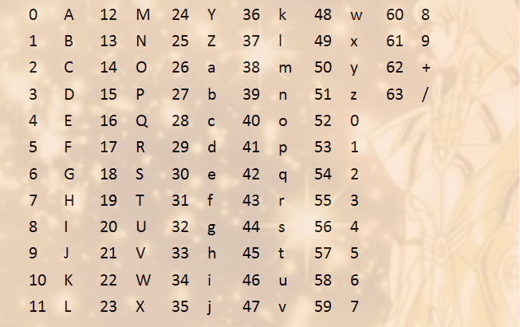

# 数据加密相关知识

5LuW5b6I5bm46L+Q77yM55yf55qE77yM5bCx5ZKM5b2T5Yid55qE5oiR5LiA5qC35bm46L+Q

## 1.base64编转码

## 1.1介绍

[base64参考链接](https://www.liaoxuefeng.com/wiki/897692888725344/949441536192576)

base64是一种用64个字符来表示任意二进制数据的方法，实际上并`不属于加密范畴`。

### 1.2加密原理

1. 准备包含64个字符的数组，如：`["A", "B", "c", ..., "+"]`
2. 对将要编码的二进制数据处理，每3个字节为一组，即一组 `3*8=24bit`
3. 将该组分为4组，每组`6bit`
4. 将该4组每组在头部增加两位`00`，变为1个字节，共4个字节
5. 4个字节中的有效位为`2^6=64`,此为64的来历
6. 在6个有效位对应准备好的64个字符，逐一对应编码
7. 完成加密
8. 解密的过程逆向即可

注意：

由于是3个字节增加为4个字节，所以有可能到末尾的时候为剩余1个或2个字节，此时

- 不足6bit的时候结尾补0，直到6bit
- 完全没有分配的时候，直接使用`=`

### 1.3代码示例

[base64_demo](./codes/base64/base64_demo.py)

## 2.MD5算法

### 2.1介绍

- 消息摘要算法，一种哈希算法，众多哈希算法中的一种，也可以用来加密
- `可以为任何文件（不管其大小，格式，数量）产生一个独一无二的数字指纹`
- 任意长度的数据算出的MD5值长度固定
- 抗修改，抗碰撞

### 2.2加密原理

1. 填充，对加密的二进制后面添加一个1和无数个0，使其位长对512求余数为448，其位长变为`n*512 + 448`，剩余的64位
2. 初始化变量，初始128位值用于第一轮计算，固定不变，为`A=0x01234567，B=0x89ABCDEF，C=0xFEDCBA98，D=0x76543210`
3. 处理分组数据

注意：

- 填充必须执行，即使余数已经为448

# TODO:

## 3.AES加密（对称加密）

## 4.RSA加密（非对称加密）

欧拉函数：

任意给定正整数n，在小于等于n的正整数之中，有多少个与n构成互质关系：$$\phi(p^k)=p^k(1- \frac{1}{p})$$

欧拉定理：

如果两个正整数a和n互质，则n的欧拉函数 φ(n) 可以让下面的等式成立：$$a^{\phi(n)} \equiv 1(mod n)$$

即a的φ(n)次方被n除的余数为1。
